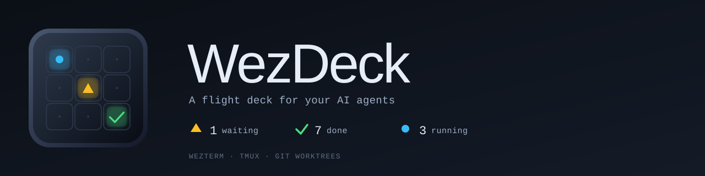

<p align="center">
  
</p>

<h1 align="center">WezDeck</h1>

<p align="center">
  <em>A flight deck for your AI agents — built on WezTerm, tmux, and git worktrees.</em>
</p>

<p align="center">
  <a href="LICENSE"></a>
  
  
  
  
</p>

> One WezTerm tab per repo. One tmux window per worktree. One pane per agent. One keystroke to find what's waiting on you.

This repository is the source of truth for the WezDeck runtime. The GitHub repo is [`yunsii/wezdeck`](https://github.com/yunsii/wezdeck) (the previous `yunsii/wezterm-config` URL still works via GitHub's permanent redirect).

## ✨ Highlights

- **Tab × Worktree × Agent in one frame** — every WezTerm tab is one repo, every tmux window inside it is a linked git worktree, every pane can host an agent CLI (`claude` / `codex` / `grok` / …).
- **Primary pane auto-resume** — managed agent panes boot through `agent-launcher.sh` with `<base>-resume`; after WezTerm or machine restart, entering a worktree continues the last conversation (falls back to a fresh session when none exists).
- **Live attention surface** — per-tab badges plus a right-status counter `⟳ N running ⚠ N waiting ✓ N done`, driven by agent hooks → `attention.json`.
- **In-slot jump keys** — `Alt+j` / `Alt+k` / `Alt+l` step waiting / done / running; `Alt+/` and `Alt+x` are occasional overview / overflow pickers, not the main loop.
- **One keystroke to spawn a worktree** — `Ctrl+k g d/t/h` carves out a linked worktree (with its own agent) when no suitable slot exists.
- **Manifest-driven hotkeys** — `wezterm-x/commands/manifest.json` is the single source of truth; per-machine overrides live in `wezterm-x/local/keybindings.lua`.

## 🎛️ Workbench · A day in the loop

> Pick the right isolation slot (worktree), then continue inside it. Attention keys are in-slot navigation — not the primary way you find work.

```text
need arises
  → Alt+w/c/s  enter workspace · Alt+1..9  pick repo tab
  → Alt+g      select an existing worktree
       └─ none fits → Ctrl+k g d|t|h  create, then enter
  → primary pane auto-resumes the agent for that cwd
  → in-slot: Alt+j waiting · Alt+k done · Alt+l running
       · verify with Alt+v (VS Code) / Alt+b (headless Chrome)
       · occasionally Alt+/ overview or Alt+x overflow
  → deliver onto origin/HEAD → recycle (dev-*) / reclaim (task|hotfix)
```

| Stage | Capability | Deep dive |
|---|---|---|
| Land on the slot | Workspace + tab + **`Alt+g` worktree picker**; create when missing | [Workspaces](docs/workspaces.md) |
| Continue after restart | **`<base>-resume`** via `agent-launcher.sh` + access-ledger focus restore | [Architecture · startup](docs/architecture.md#startup-invariants) |
| In-slot loop | Attention badges / counter + **`Alt+j/k/l`** | [Agent attention](docs/agent-attention.md) |
| Verify | Host helper: **`Alt+v`** / **`Alt+b`** (MCP shares the CDP instance) | [Browser debug](docs/browser-debug.md) |
| Close the round | Mainline delivery (no PR) → **`worktree-recycle`** / reclaim | [Maintenance loop](docs/workspaces.md#maintenance-loop-wezdeck-standing-policy) |

Longer narrative (features + evolution): [`docs/presentations/`](docs/presentations/). Day-loop forensics from live logs: [`scripts/dev/workflow-timeline.sh`](scripts/dev/workflow-timeline.sh) · [Diagnostics · Workflow timeline](docs/diagnostics.md#workflow-timeline).

## 🧭 How It Works

```
WezTerm tab          ─┐
  └─ tmux window     ─┤  one repo  ·  one worktree  ·  one agent (resume)
       └─ tmux pane  ─┘
                       ↑
       agent hooks → attention.json → tab badges + right-status counter
                                       ↑
                                  Alt+j/k/l  in-slot jumps
```

Full architecture, ownership boundaries, and the WSL ⇄ Windows channels: [`docs/architecture.md`](docs/architecture.md). Session + interop map (workspace/tab/tmux/worktree/agent/attention ↔ session-bridge ↔ Feishu): [Session & Interop Overview](docs/architecture.md#session--interop-overview).
## ✅ Requirements

| | Required | Notes |
|---|---|---|
| **WezTerm** | nightly | `hybrid-wsl` mode runs on the Windows nightly build |
| **tmux** | ≥ 3.7 | DEC sync 3.6+; `refresh-from-pane` 3.7+. Prefer OS/brew package when ≥ 3.7; user-prefix `~/.local` only if distro is older (e.g. Ubuntu apt 3.4). [Install](docs/tmux-install.md) · [Why](docs/ime-flicker-and-sync-output.md) |
| **lua5.4** | recommended | Powers the sync precheck; missing → precheck skipped with a warning |
| **jq** | recommended | Agent-attention writer & focus path; missing → degraded labels |
| **go ≥ 1.21** | optional | For maintainers of `native/picker/`. End users get a sha256-pinned prebuilt tarball via the release fetcher |
| **python3** | optional | Only for WakaTime status |

Supported runtime modes: `hybrid-wsl` (Windows WezTerm + WSL/tmux) and `posix-local` (Linux / macOS local).

## 🚀 Quick Start

```bash
# 1. Seed your machine-local config
cp -r wezterm-x/local.example/ wezterm-x/local/
$EDITOR wezterm-x/local/constants.lua   # runtime_mode, default_domain, shell, …
$EDITOR wezterm-x/local/shared.env      # WAKATIME_API_KEY, MANAGED_AGENT_PROFILE, …

# 2. Sync the runtime into $HOME (writes ~/.wezterm.lua + ~/.wezterm-x/)
skills/wezterm-runtime-sync/scripts/sync-runtime.sh

# 3. Reload WezTerm and confirm the right status shows
#    "⟳ 0 ⚠ 0 ✓ 0" — that means the attention pipeline is live.
```

Full setup walkthrough: [`docs/setup.md`](docs/setup.md).

## 📚 Documentation

**Get started**
- [Setup](docs/setup.md) · [Daily workflow](docs/daily-workflow.md) · [Workspaces](docs/workspaces.md) · [Presentations](docs/presentations/)

**Daily use**
- [Keybindings](docs/keybindings.md) · [tmux UI](docs/tmux-ui.md) · [Agent attention](docs/agent-attention.md) · [Browser debug](docs/browser-debug.md)

**Internals**
- [Architecture](docs/architecture.md) · [Performance](docs/performance.md) · [Diagnostics](docs/diagnostics.md) (incl. [workflow timeline](docs/diagnostics.md#workflow-timeline)) · [IME & sync output](docs/ime-flicker-and-sync-output.md)

**Releases**
- [Host helper](docs/host-helper-release.md) · [Picker](docs/picker-release.md)

Agent rules: [`AGENTS.md`](AGENTS.md). Reusable user-level profiles: [`agent-profiles/`](agent-profiles/).

## 🎨 Brand

Brand SVGs and the geometric construction notes live in [`assets/brand/`](assets/brand/) — see [`assets/brand/README.md`](assets/brand/README.md) for the asset table and proportional rules.

## 📄 License

MIT © Yuns. See [LICENSE](LICENSE).
