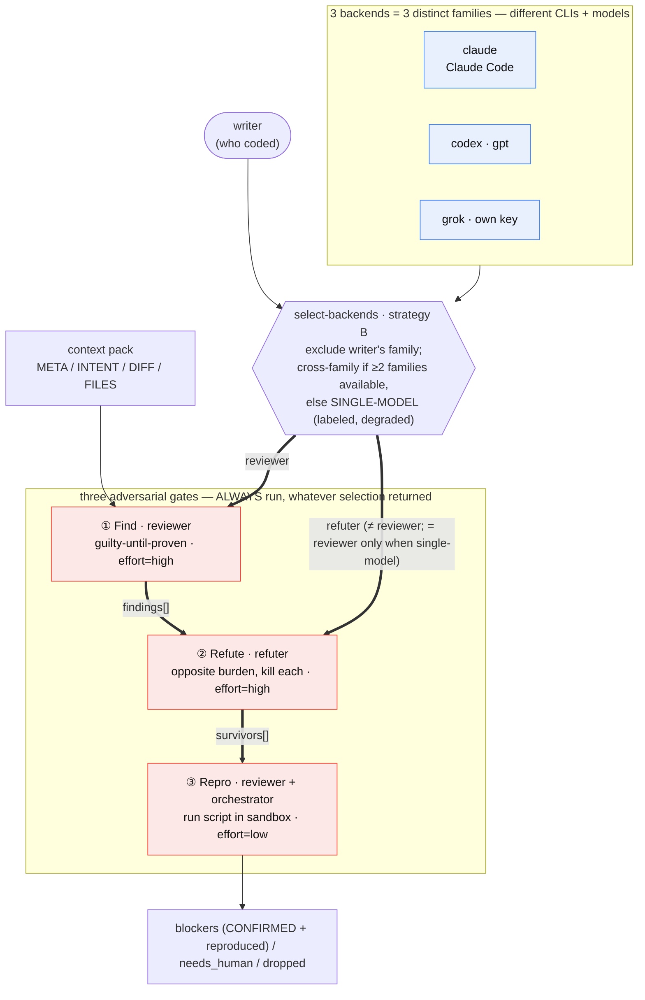

# Adversarial Review (cross-agent) — v0.2

**Authority:** `scripts/dev/adversarial-review/` is the **only** skill+runner unit
(SKILL.md + run.sh + lib + prompts). All other paths are **symlinks**.
**Procedure:** that directory's `SKILL.md`.
**This file:** knowledge base (how/why), not a second procedure.

## Agent skill (not for humans to run by hand)

Agents load the platform skill and execute `run.sh` themselves.
Humans only state intent (e.g. 审一下 / 对抗审查). Do not make the user the primary
operator of this script.

| Surface | Discovery |
| --- | --- |
| **Single source** | `scripts/dev/adversarial-review/` |
| **User-level host** | `~/.agents/skills/adversarial-review` → source |
| **Claude skills** | `~/.claude/skills/adversarial-review` → agents (or source) |
| **OpenClaw workspace** | `openclaw/workspace/skills/adversarial-review` → source |
| **Repo-root discovery** | `skills/adversarial-review` → source |
| **Host TUI doctrine** | `agent-profiles/v1/en/validation.md` → Adversarial review |
| **Install / refresh links** | `scripts/dev/link-platform-skills.sh` |

**TOOL vs TARGET:** `run.sh` lives in TOOL_HOME; the repo under review is TARGET
(`--repo` or cwd git toplevel). Do not require TARGET to vendor the scripts.


`scripts/dev/adversarial-review/` runs a **cross-agent adversarial code review**
over a diff, in three gates, and classifies findings so you can use the tool to
**recursively improve itself** (dogfood) without silent false confidence.

## What counts as 对抗审查

**Adversarial = multi-role.** Minimum:

1. **Find / reviewer** — guilty-until-proven; produce findings with failure scenarios  
2. **Refute / refuter** — opposite burden; try to kill each finding  
3. **Repro** (recommended) — empirical check for CONFIRMED items  

- Prefer **different** agent families (e.g. Claude-TUI × Codex-Grok-profile).  
- If only **one** model is available: still run **two roles** (two calls, opposite
  prompts). Label **SINGLE-MODEL**. Do **not** skip refute.  
- A single monologue (one Main-Grok essay) is **设计批判**, **not** 对抗审查.

Orchestration may be `run.sh` or Main spawning two ACP/TUI turns with distinct
role prompts. Same binary twice with different stance **is** multi-role;
same chat turn with no role split **is not**.

## Reporting disclosure (mandatory)

Any Feishu/chat claim of「对抗审查」**must** include this block (OpenClaw L0-21).
Never ship conclusions alone. Never use the title if refute role was omitted.

```text
## 对抗审查披露
- 形态: 三门全量 | 多角色·单模型
- reviewer 全名 / 立场: …
- refuter 全名 / 立场: …
- repro: 已跑 | 跳过（理由）
- 命令或范围: run.sh … | Main 编排两次 …
- skipped_gates: … | 无
- 关键结论: 每条绑定 find / refute / repro
```

| 形态 | 何时使用 | 可否写 cross-agent |
| --- | --- | --- |
| **三门全量** | find+refute+repro，且 reviewer≠refuter 家族 | 可以 |
| **多角色·单模型** | find+refute（±repro），同家族/同后端 | 否；标 SINGLE-MODEL |
| **设计批判** | 单角色分析 | **不要**叫对抗审查 |

Full backend names: see `openclaw/docs/agent-architecture.md` and
`openclaw/scripts/agent-matrix-status.sh`.

Design rationale (why three gates, why empirical repro matters more than debate)
is unchanged from v0.1; v0.2 tightens **contracts**, **naming**, **sandboxing**,
and **self-application**.

## The three gates

| Gate | Who | What |
| --- | --- | --- |
| 1 · Find | `--reviewer` | Finds defects under a **guilty-until-proven** stance; every finding must carry a concrete `failure_scenario`. |
| 2 · Refute | `--refuter` | A *different* model tries to **refute** each finding; burden of proof is on the finding (unsure → refuted). |
| 3 · Empirical | `--reviewer` + sandbox | For each `CONFIRMED` finding, the model writes a minimal repro script and the orchestrator **runs it in a sandbox that mirrors the reviewed revision/worktree** (not ambient `HEAD`). |

### Modes (survivor definition)

| Mode | Survivors (blockers) | Also reported |
| --- | --- | --- |
| **`strict` (default)** | only `CONFIRMED` **and** `repro.reproduced==true` | `needs_human` (timeout/dangerous/inconclusive); PLAUSIBLE dropped |
| **`advisory`** | same blockers | PLAUSIBLE + needs_human kept in a separate section |

Never claim “survived all three gates” for PLAUSIBLE items — they skip gate 3.

The human report labels each group for readability: strict survivors →
**`[阻塞]`**, `needs_human` / PLAUSIBLE → **`[非阻塞·backlog]`**, dropped →
non-blocking. `--json` keeps the raw `survivors` / `needs_human` / `dropped`
field names unchanged (machine contract), so this is a display-only aid.

## Design: pipeline, effort, no-resume

The whole flow in one view — **who reviews** (cross-model selection) and **how
they oppose each other** (the three gates): the code's *writer* never reviews
its own work (strategy B excludes its family); a cross-family **reviewer** and
**refuter** take opposing stances; an **empirical repro** settles survivors.
Selection only picks *which* agents/models — the same three gates run
identically whether the pair is cross-family or a degraded single-model.



Each gate is a **fresh, stateless provider call**; the prior gate's JSON is fed
as INPUT to the next — the runner threads state, not a resumed session. Agents
never talk directly; `run.sh` is the only conduit (validate → merge by id →
segment → next stdin), and `id` (`file:line:summary`) is the cross-gate anchor.
See [`brainstorm.md` §2](brainstorm.md#2-provider-layer--agent-to-agent-data-flow).

**Reasoning effort per gate:** find=`high`, refute=`high` (deep defect-hunting +
rigorous refutation), repro=`low` (writing a mechanical script). Passed to the
provider CLI. Mapping to each CLI and the measured-latency rationale (why
**codex**, not grok, is the cost) live in the shared provider layer — see
[`brainstorm.md` §4](brainstorm.md#4-reasoning-effort-per-stage-design-decision).

**No session resume — the cross-model critic depends on it.** A CLI session is
single-provider, so `claude`-find → `codex`-refute could not share one anyway;
and even same-provider, resuming would carry the finder's reasoning into the
refuter, collapsing the opposite-burden stance into self-agreement. Full
rationale (shared with brainstorm):
[`brainstorm.md` §3](brainstorm.md#3-no-session-resume-design-decision).

**Offline mock.** `PROVIDER_MOCK=1` returns canned, shape-correct JSON per
prompt with no LLM call — for fast, deterministic runner tests. See
[`brainstorm.md` §5](brainstorm.md#5-offline-mock--testing).

## Review rubric (`lib/rubric.conf`)

The critic's review dimensions are a **configurable standard**, not hard-coded —
the role setting's authoritative list (see [`brainstorm.md` §8](brainstorm.md#8-agent-context-profile-vs-role-setting)).
`run.sh` injects it into the critic prompt after `=== RUBRIC ===`, and the prompt
declares it the **sole** review criteria (the profile is background).

| kind | dimensions | handling |
| --- | --- | --- |
| **repro-gated** | correctness · security · resource · concurrency | need a concrete `failure_scenario`; gate 3 runs a sandbox repro; can become a **strict blocker** |
| **design / advisory** | consistency · extensibility · maintainability | state concern + impact (no crash); gate 3 **skips** repro; surfaces as `needs_human` — **never a strict blocker** |

- **Add a dimension** = add a line to `rubric.conf` (`dimension|repro_gated|guidance`); no prompt or code edits.
- `run.sh` routes each finding by `rubric_repro_gated(category)`: design dimensions
  bypass repro, so consistency/extensibility surface as advisories instead of
  being dropped for lacking a crash. This is how the tool covers design quality
  without diluting the repro-gated precision of runtime defects.
- **Evidence discipline (design dimensions).** A design/advisory finding must cite
  a basis — a pack fact, `file:line`, or an authoritative constraint — not a bare
  assertion from taste; the refuter marks an uncited design claim `refuted`
  (`prompts/critic.md` + `prompts/refute.md`). Keeps design-mode review from
  drifting into opinion.

## Writer-aware backend selection (strategy B)

**Rule:** the agent family that *wrote* the code is not the default reviewer.
Only when availability is insufficient may the same family be reused (must still
be multi-role; label SINGLE-MODEL / degraded). The selection ↔ gates flow is the
combined diagram under [§ Design](#design-pipeline-effort-no-resume).

The point of *cross-model*: reviewer and refuter run on **genuinely different
backends** (different CLIs, models, and — for grok — a different API key), so a
finding survives only if a *second, independent* model can't kill it. Same-family
reuse is allowed only as a labeled, degraded fallback. The table below is the
concrete writer → pair mapping.

| writer (who coded) | default pair (when available) |
| --- | --- |
| `claude` / Claude-ACP / Claude-TUI | `codex` × `grok` |
| `codex` / Codex-ACP / Codex-TUI / grok | `claude` × `codex` (else `claude` × `grok`) |
| `main` / Main-Grok / `human` | `claude` × `codex` (else × `grok`) |

**Selection weights, per role** (`lib/select-backends.sh`), highest first:

1. **Hard constraint** — exclude the writer's family; the pair must stay
   multi-role (two roles, opposite prompts).
2. **Role preference** — the **reviewer** (finder) defaults to `claude`; the
   **refuter** follows `roles.conf`'s `refute` order (`grok` → `codex` → `claude`),
   avoiding the reviewer's and writer's family.
   So `claude` gravitates to Find and `grok`/`codex` to Refute — *unless the
   writer is claude*, in which case the reviewer falls to `codex` (avoid-writer
   outranks the claude-as-reviewer preference).
3. **Degrade ladder** — cross-family → partial-avoidance (reviewer shares the
   writer's family) → single-model (same backend, two roles; labeled degraded).

The human report always prints the disclosure fields: writer / form / reviewer /
refuter / degraded / reason.

```bash
# auto by who wrote the code (TARGET = cwd git root, or --repo)
run.sh <BASE> --writer grok --mode strict
run.sh <BASE> --repo /path/to/other-repo --writer main --dry-run --no-probe
run.sh <BASE> --writer claude-acp --dry-run --no-probe

# explicit pair still wins when both flags set
run.sh <BASE> --reviewer claude --refuter codex

# inspect selection only
lib/select-backends.sh --writer codex --json --no-probe
```

## Usage

```bash
# TOOL_HOME = scripts/dev/adversarial-review (or linked user-level skill dir)
$TOOL_HOME/run.sh <BASE_REF> [options]

  --repo PATH        TARGET git repo to review (default: cwd git toplevel)
  --writer W         who wrote code: claude|codex|grok|main|human
                     (auto-selects reviewer/refuter; strategy B)
  --auto-select      select backends for writer (default writer=human if omitted)
  --no-probe         PATH-only availability (skip live headless ping)
  --reviewer P       backend: claude|codex|grok (optional if --writer)
  --refuter P        backend alias (optional if --writer)
  --critic P         deprecated alias for --refuter
  --head REF         diff endpoint                         (default: HEAD)
  --mode MODE        strict | advisory                     (default: strict)
  --min-severity L   critical|high|medium|low              (default: low)
  --json             machine-readable output (includes writer/form/degraded)
  --dry-run          print the planned gates, call no agents
  --fail-on-finding  exit 10 if any strict survivor

$TOOL_HOME/run.sh selfcheck [claude|codex|grok ...]
$TOOL_HOME/run.sh dogfood [--mode MODE] [options]
```

Examples:

```bash
# last commit, Claude finds, Codex+Grok refutes (recommended when GPT blocked)
run.sh HEAD~1 --reviewer claude --refuter grok

# Claude finds, native Codex/GPT refutes (when account allows GPT)
run.sh HEAD~1 --reviewer claude --refuter codex

# advisory report for humans (includes PLAUSIBLE)
run.sh origin/master --mode advisory --reviewer claude --refuter claude

# recursive self-review of this tool's working tree
run.sh dogfood --mode strict --fail-on-finding

# provider JSON round-trip
run.sh selfcheck claude
```

**Stage 0 auto-skips** diffs that are docs/tests only.

## Recursive self-optimization (dogfood)

Intended loop (human or agent supervised — **no autonomous rewrite loop**):

```text
1. change scripts/dev/adversarial-review (or claw-worktree path core)
2. run.sh dogfood --mode strict
3. read survivors / needs_human
4. apply targeted fixes
5. re-run dogfood until survivors empty (or accept needs_human)
6. stop — do not auto-commit or unbounded multi-agent rewrite
```

`dogfood` scopes the diff to:

- `scripts/dev/adversarial-review/**`
- `docs/adversarial-review.md`
- `openclaw/scripts/claw-worktree.sh` (path core often co-evolves)

Stopping conditions (hard):

- max 3 dogfood→fix cycles per session unless a human re-authorizes
- never `git commit` / `git push` from inside repro scripts
- never treat SINGLE-MODEL (refuter unavailable) as full cross-agent success

## Context pack v1

Find/refute input is a **context pack** (same bytes both gates), not bare diff:

| Section | Content |
| --- | --- |
| META | target, base/head, writer, pack_id |
| INTENT | `--intent` / `--intent-file` / commit message / degraded none |
| CHANGESET | changed paths |
| DIFF | unified diff (`BASE..HEAD` or worktree vs BASE) |
| FILES | related file bodies (budget-capped) |
| NOTES | truncations / omissions |

```bash
# include uncommitted TARGET changes
run.sh HEAD --head WORKTREE --repo /path/to/target \
  --writer main --intent "fix X" --mode strict

# keep pack for audit
run.sh HEAD~1 --keep-pack /tmp/adv-pack --writer main --dry-run --no-probe
```

## Structure

```
scripts/dev/adversarial-review/     # SINGLE SOURCE (skill + runner unit)
  SKILL.md                   agent procedure (only body)
  run.sh                     three-gate orchestration (agent-agnostic)
  lib/provider.sh            plugin loader + dispatch (NO backend names)
  lib/providers/*.sh         one plugin per backend (claude / codex / grok)
  lib/roles.conf             role -> effort + candidate standard (see brainstorm.md §7)
  lib/roles-lib.sh           roles.conf reader
  lib/select-backends.sh     writer-aware pair selection (reads roles.conf)
  lib/findings-schema.json   inter-stage JSON contract (enforced)
  prompts/{critic,refute,repro}.md
scripts/dev/link-platform-skills.sh   user-level + in-repo symlinks
docs/adversarial-review.md   this file (KB only)
```

## Backend aliases (three review paths)

**Model / effort standard + how to add a backend (plugin interface):** see
[`brainstorm.md` §7](brainstorm.md#7-model--effort-standard-and-adding-backends).
**Agent context (profile vs role setting — profile always loads, keep the role
setting authoritative & self-contained):** see
[`brainstorm.md` §8](brainstorm.md#8-agent-context-profile-vs-role-setting).

These names are **review backends**, not OpenClaw ACP harness ids (`claude` /
`codex` only at the ACP layer). `grok` calls the **standalone Grok CLI**
(`~/.grok/bin/grok`, headless `-p --output-format json`) **directly** — NOT the
codex gateway, which serves gpt only (`grok-4.5` 404s there, and Grok uses its
own API key). The `grok` alias name is kept for back-compat.

| Alias | Meaning | Host config used | Typical role |
| --- | --- | --- | --- |
| `claude` | Claude Code CLI | `~/.claude` | find / repro |
| `codex` / `gpt` | Codex native default model (GPT when account allows) | host `~/.codex` default | refute or second opinion |
| `grok` | Standalone Grok CLI (`grok -p`) + `grok-4.5` | `~/.grok` (own API key) | Grok-side refute / matrix |

**OpenClaw ACP isolation** (`~/.openclaw/acpx/codex-home`) is for Feishu
`/acp spawn codex` only. This review tool **must not** set `CODEX_HOME` there,
so native interactive Codex stays untouched.

### Recommended matrices

| Stage | reviewer | refuter | Notes |
| --- | --- | --- | --- |
| Now (proxy GPT often 404) | `claude` | `grok` | Real cross-stack: Claude vs Grok |
| When GPT account works | `claude` | `codex` | Claude vs GPT |
| Optional third matrix | `codex` | `grok` | **Cross-family** (separate CLIs/models) — full gate 2 runs |

If gate 2 is skipped (unavailable or same family), results are **SINGLE-MODEL**
— never claim full cross-agent success.

## Provider status

- **Claude** — `selfcheck claude` expected green when Claude Code is logged in.
- **codex** — host Codex default; on some proxy account groups `gpt-5.5` returns
  404 → mark unavailable / SINGLE-MODEL, do not fake green.
- **grok** — standalone Grok CLI (`~/.grok/bin/grok`, own API key); preferred
  refuter when GPT is blocked. NOT the codex gateway (which lacks grok).
- Gate 2 skip is always **reported** (`skipped_gates`); never silent cross-agent claim.

## Safety

- Reviewer/refuter generation run **read-only** (Claude plan mode + read tool allowlist).
- Repro scripts run in a **detached sandbox worktree that matches the reviewed tree**:
  - normal range `BASE..HEAD_REF` → checkout **`HEAD_REF`** (not whatever the agent cwd HEAD is)
  - `dogfood` / `WORKTREE` → checkout **`BASE`** (usually `HEAD`), then **copy** the
    reviewed paths from the live worktree (so uncommitted edits are present)
  - `trap` on EXIT/INT/TERM/HUP removes the sandbox worktree (no leak on interrupt)
  - 60s timeout; expanded danger-pattern scan (network, sudo, push/publish, inline
    eval, …); flagged scripts are not executed (`needs_human`)
  - best-effort: sandbox `.git` is made read-only before exec
- This is **not** a full OS sandbox (no bubblewrap/seccomp). Treat repro as
  semi-trusted automation; do not enable auto-fix loops without a human.
- Nothing is auto-fixed. Survivors are for you (or a supervised agent) to adjudicate.

## Exit codes

| Code | Meaning |
| --- | --- |
| 0 | completed; no strict survivors (or fail-on not set) |
| 1 | usage |
| 2 | reviewer provider unusable |
| 3 | internal (e.g. invalid stage1 JSON) |
| 10 | `--fail-on-finding` and ≥1 strict survivor |

## Open questions

1. Codex CLI binary + `exec --json` flags on this host (`selfcheck codex`).
2. Project-specific verify conventions for gate 3 beyond shell/unit checks.
3. Cost controls for huge monorepo diffs (`--paths` future).

## Backlog (deferred)

Ideas ported in from the relay-doctrine review, deliberately **not** built yet —
they fail the 95-point rule (a crash mid-run wastes tokens but is not a correctness
bug), and neither skill has a discussion-orchestrator to hang them on. Applies to
**both** skills (brainstorm reuses this provider layer):

- **① Long-run decoupling (heavy version).** Host-TUI is already covered via
  background Bash + `--json` file (see each `SKILL.md`). The heavy form — a
  progress-file + announce-on-done loop, needed for OpenClaw Main (飞书) where a
  synchronous `run.sh` blocks the whole turn — stays deferred; Main would need
  `tmux run-shell -b`, and backgrounded children die in some popup scopes.
- **② Stage-output ledger for resume.** Append each stage's JSON to a per-run dir
  so a crash resumes from the last good stage (audit + token save). Compatible with
  no-session-resume (it caches *conclusions*, not a provider session — see
  [`brainstorm.md` §3](brainstorm.md#3-no-session-resume-design-decision)); only
  worth it if runs start failing often.
- **⑥ Guardrail, not a task.** Do **not** build a 3-way auto-rotation orchestrator.
  Neither skill has one; keeping it that way *is* the 95-point line.

## What it is NOT

- Not a style/simplification pass (`/simplify`).
- Not an unbounded self-modifying agent. Dogfood is a **supervised** loop.
- Not a substitute for human ownership of security-critical merges.
