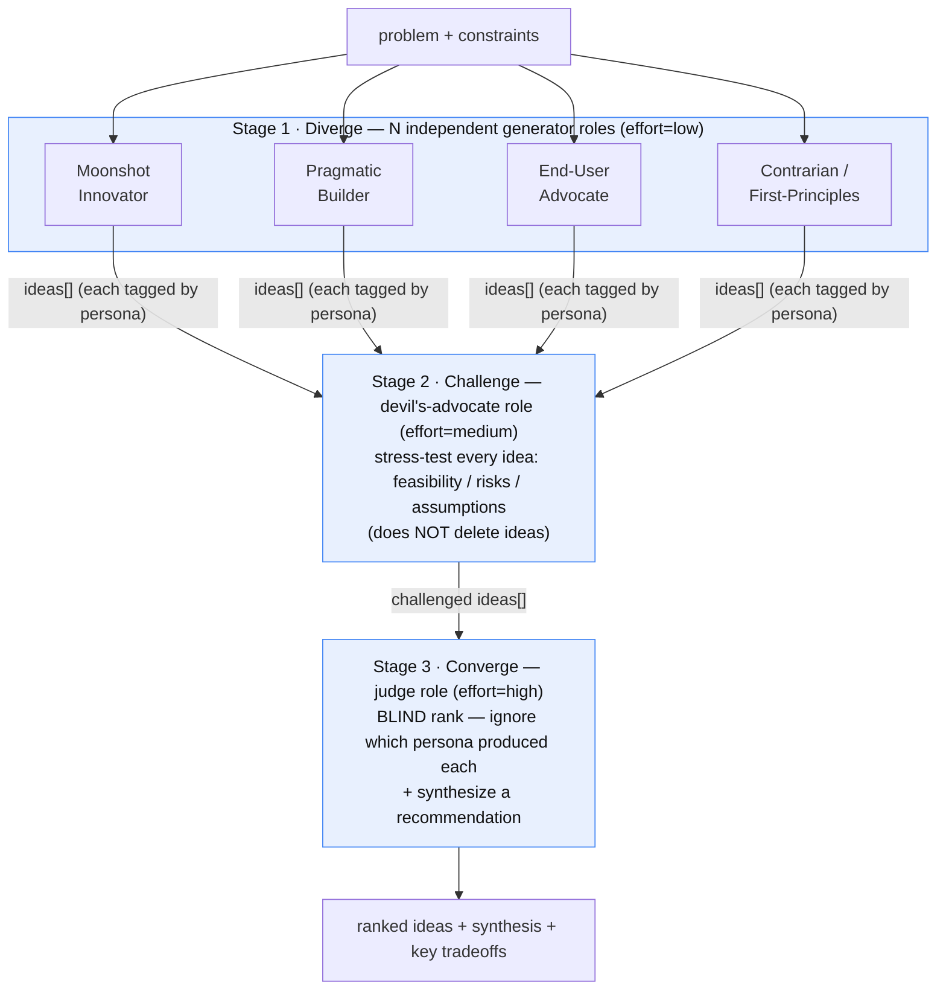
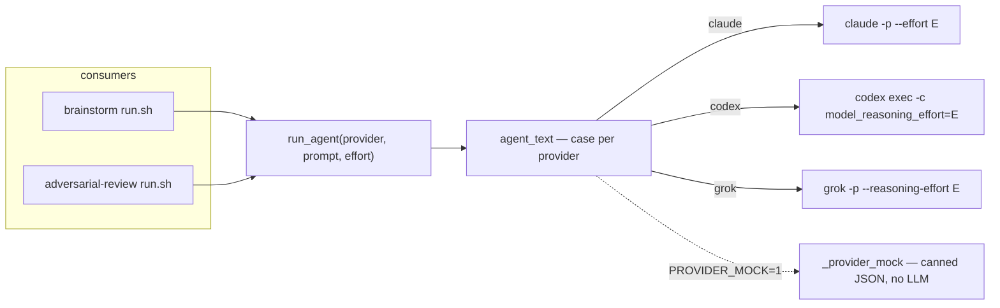
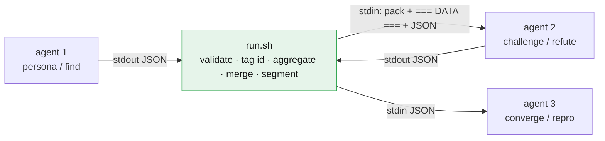
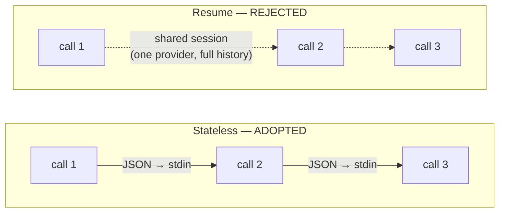

# Brainstorm — Design Notes

**Authority:** `scripts/dev/brainstorm/` is the only skill+runner unit
(`SKILL.md` + `run.sh` + `lib/` + `prompts/`); other paths are symlinks.
**Procedure:** that directory's `SKILL.md`.
**This file:** design rationale (how/why) — not a second procedure.

Brainstorm turns a free-form problem into ranked, synthesized ideas through a
**divergent → convergent** pipeline run by multiple independent personas across
multiple model backends. It is the generative sibling of `adversarial-review`
and **shares that skill's provider layer** (`lib/provider.sh`) — so the two
key cross-cutting decisions below (reasoning **effort** and **no session
resume**) apply to both skills.

## 1. Overall flow

Three *role types* collaborate adversarially: many independent **generators**,
one **devil's-advocate**, one **blind judge**.

The generators fan out from the same problem **in parallel and in isolation**
(each is one arrow in, one JSON out); the devil's-advocate and judge each see
the *whole* set, not a conversation. Role interaction is deliberate:

- **Generators** run in parallel and in **isolation** — a persona sees only the
  problem + its own lens, never another persona's ideas. Diversity comes from the
  lenses (and from rotating them across `claude` / `codex` / `grok`); isolation is
  what prevents groupthink / anchoring (see §3).
- The **devil's-advocate** sees *every* idea and annotates feasibility / risks,
  but never deletes — pruning is the judge's call, not the critic's.
- The **judge** ranks **blind** to which persona authored each idea (so a
  strong-sounding source can't inflate a weak idea), then synthesizes.
- Every hop is a **stateless call** (JSON in → JSON out), never a resumed
  session — that is *how* the roles stay independent (see §2, §3).

## 2. Provider layer & agent-to-agent data flow

Both skills call `lib/provider.sh`:

`run_agent` is a pure function: same `(provider, prompt, input, effort)` →
retriable, cacheable, JSON-validated (retries once on non-JSON). No hidden
session state.

### How stages hand off (orchestrator-mediated)

**Agents never talk to each other.** There is no shared session and no
agent-to-agent channel — `run.sh` is the *only* conduit. Every stage is
`stdin JSON → agent → stdout JSON`; the orchestrator catches one stage's output
and threads it into the next stage's input.

Threading rules — the reasons this shape was chosen:

- **Isolation passes conclusions, not thoughts.** Diverge personas never see
  each other; the refuter sees the pack + findings JSON, **not the finder's
  reasoning**. Independence (anti-groupthink, anti-confirmation-bias) comes
  precisely from handing over *results* (JSON), never *thought process* or a
  resumed context.
- **The orchestrator aggregates.** Per-persona outputs are unioned in `run.sh`
  (`jq '$a + $b'`), each idea tagged `id = "<persona>::<title>"` for provenance.
- **`id` is the cross-stage anchor.** Downstream enrichments (challenge's
  feasibility/risks, converge's score/verdict, refute's `refuted` flag) are
  merged back onto the base set **by id** (`from_entries`), so a reordered,
  partial, or mangled agent reply can neither drop nor misalign items.
- **Markers segment the payload.** `=== PACK / IDEAS / FINDINGS ===` let the
  receiving agent separate "context" from "data to transform" — and let the
  mock extract the prior result.
- **Schema is the contract.** `ideas-schema.json` / `findings-schema.json`;
  every hop is `_validate`d and invalid input degrades safely (§6).
- **One-way pipeline.** Data flows forward only; selection / merge / ranking
  happen in `run.sh` (jq), never via back-and-forth chatter between agents.

This purity — conclusions in, conclusions out, orchestrator-threaded — is what
makes cross-provider work, and what makes both §3 (no-resume) and §5 (offline
mock) possible.

### Which backend runs which role

There is no writer to avoid (brainstorm reviews nothing), so role→backend
assignment is simpler than adversarial-review's strategy B — the goal is only to
*spread* roles across distinct models, not to exclude an author:

- **Availability order** `claude > codex > grok` (first to resolve wins ties).
- **Generators** round-robin over the available backends (`persona i →
  providers[i % n]`) — lens diversity × model diversity.
- **Challenger** defaults to the 2nd available backend and the **judge** to the
  3rd, so the three role groups land on *different* models when ≥3 are up
  (cross-model); it degrades to fewer only when fewer backends are available.
- **Per-stage fallback**: if a role's backend errors at call time it retries on
  the next available backend, so a broken default can't sink the run.

So the weight here is a *spread* goal (maximize distinct models across roles),
whereas adversarial-review's is an *avoid-the-writer* constraint — same provider
layer, different selection intent.

## 3. No session resume (design decision)

`claude -p`, `codex exec`, and `grok` all **support** resume
(`--resume`/`-c`/`--continue` etc.). Brainstorm and adversarial-review
deliberately **do not use it**. The "multi-turn" nature is orchestration-level:
the runner threads each stage's JSON into the next call's stdin.

Three reasons:

1. **Resume is single-provider.** A session belongs to one CLI's on-disk store
   (`~/.claude` vs `~/.codex` vs `~/.grok`). The main path here is
   *cross-provider* (diverge rotates backends; challenger/judge differ from the
   diverge primary). `claude` cannot resume a `codex` session. On the very path
   we care about, resume is simply unavailable.
2. **Resume pollutes role independence.** Even same-provider, resuming carries
   the prior role's full reasoning/self-justification into the next role. A
   diverge persona that just "sold itself" on an idea, resumed into the
   challenge role, inherits confirmation bias. Adversarial strength (and
   brainstorm diversity) come from **perspective isolation**; resume does the
   opposite — context sharing.
3. **Resume breaks reproducibility.** Stateless calls re-run identically and
   validate per stage; resume adds implicit disk state that expires, and
   concurrent runs would have to manage session-id lifecycles.

**Community practice agrees for this sub-case.** Persistent/resumed sub-agents
are the pattern for *continuing related work*; for an *independent critic/judge*
the consensus is the opposite — give it an isolated, clean context fed only the
diff/ideas, and prefer cross-model. (Cf. the *Refute-or-Promote* adversarial
stage-gated methodology, which is structurally the adversarial-review pipeline.)

**If token cost of re-sending context is the worry**, the right lever is
provider-side **prompt caching** (stateless, non-polluting) — not resume, which
would sacrifice both cross-model diversity and role independence.

## 4. Reasoning effort per stage (design decision)

Different stages have different cognitive demands, so effort is **not** a single
global knob — it is set per stage and passed to the provider CLI.

| Skill | Stage | effort | Why |
| --- | --- | --- | --- |
| brainstorm | diverge | `low` | favour breadth/speed; deep reasoning doesn't make ideation broader |
| | challenge | `medium` | feasibility/risk needs some rigor, not maximal |
| | converge | `high` | scoring + ranking + synthesis is where depth pays off |
| adversarial | find / refute | `high` | deep defect-hunting and rigorous refutation |
| | repro | `low` | writing a mechanical repro script |

**Mapping** (`agent_text` in `lib/provider.sh`, empty effort ⇒ CLI default):

- `claude --effort <low|medium|high|xhigh|max>`
- `codex exec -c model_reasoning_effort=<low|medium|high>`
- `grok --reasoning-effort <low|medium|high|xhigh>`

**Why it matters — measured single-call latency** (minimal prompt, this host):

| provider | latency |
| --- | --- |
| grok | ~4.0 s |
| claude | ~6.6 s |
| codex | ~24.9 s |

The end-to-end cost was **serial calls + codex** (high reasoning + a slow
unreachable MCP it retries), *not* grok. Per-stage effort helps **codex most**
(dropping repro/diverge to `low`), and lets high-value stages (find/refute,
converge) keep depth. This replaced an earlier wrong assumption that grok's
default `xhigh` was the bottleneck — corrected by measurement.

## 5. Offline mock & testing

Routine end-to-end tests must **not** spend tokens or wall-clock on real LLM
calls. `PROVIDER_MOCK=1` short-circuits `agent_text` to `_provider_mock`, which
returns shape-correct canned JSON per prompt and **derives** challenge/refute/
converge output from the input so ids stay consistent — exercising the runner's
arg parsing, provider selection, JSON threading, jq filters, fallback, and
merge logic without any model.

- `brainstorm/test.sh` — default-mock smoke (7 checks, ~0.5 s); `--live` for real.
- Measured: brainstorm e2e ≈ **0.18 s mock** vs minutes live.

## 6. Boundary hardening

Brainstorm trusts models to return schema-shaped JSON, so it defends the seams
(surfaced by an adversarial-review pass over its own commit):

- `_validate_ideas` degrades non-array valid JSON to `[]` (not empty string,
  which crashed downstream `jq --argjson`).
- **Diverge falls back across providers per persona** — a runtime-broken first
  backend costs at most diversity for one persona, never the whole run
  (e.g. `--personas 1`). This reuses the same fallback used by challenge/converge.
- **Converge merges the judge's `score`/`verdict` back onto the challenged set
  by id** — the judge can never silently drop ideas by returning a subset.
- `key_tradeoffs` is coerced to an array (a string value no longer crashes the
  report).

## 7. Model & effort standard, and adding backends

### Two layers of isolation (priority order)

- **L1 · agent isolation (hard):** every role is an independent stateless call —
  separate context, no session resume, its own/opposing prompt. Always enforced,
  **even if all roles share one model** (that is the labeled SINGLE-MODEL
  fallback).
- **L2 · model isolation (soft):** on top of L1, prefer distinct models per role
  (cross-model); degrade to fewer only when backends are unavailable. **Never
  trade away L1 for L2.**

A role is an *agent*; the *model* is a separate axis — one role may run on
different models across runs (rotation / fallback). Only agent isolation + effort
are fixed; model is a weighted preference.

### Standard A — agent × model

| agent (CLI) | default model (env override) | profile (measured) |
| --- | --- | --- |
| `claude` | `claude-fable-5[1m]` (`ADV_MODEL_CLAUDE`) | strong reasoning · ~6.6s |
| `codex`  | `gpt-5.5` (`ADV_MODEL_CODEX`) | strong · ~25s |
| `grok`   | `grok-4.5` (`ADV_MODEL_GROK`) | fast · ~4s · good quality |

### Standard B — role → effort + candidates (from `roles.conf`)

| tool | role | effort | candidates `[default … fallback]` |
| --- | --- | --- | --- |
| adversarial | find | high | `claude codex grok` |
| adversarial | refute | high | `grok codex claude` |
| adversarial | repro | low | `grok claude codex` |
| brainstorm | diverge | low | `grok codex claude` |
| brainstorm | challenge | medium | `grok codex claude` |
| brainstorm | converge | high | `claude grok codex` |

Effort follows task nature (generation / mechanical = low; critique = medium;
judge / find / refute = high) — per the community finding that higher effort is
**not** universally better. `grok` leads fast / high-volume roles; `claude`
anchors the deepest judge/finder; `codex` rotates in for model diversity.
Adversarial selection additionally excludes the writer's family (see the Design
§ diagram); brainstorm just spreads roles across distinct models.

### Adding a backend or model (plugin interface)

Backends are **plugins** in `../adversarial-review/lib/providers/<name>.sh`, each
implementing `<name>__available / __family / __model / __invoke` (+ optional
`__aliases`). `provider.sh` loads them all and dispatches by name — it contains
no backend names.

- **Add a backend:** drop `providers/<name>.sh` and list `<name>` in the
  candidate columns of `roles.conf`. No core edits.
- **Change a model:** edit that plugin's `__model`, or set its `ADV_MODEL_*` env.
- Disclosure (report + `--json`) prints the **actual model** each role used.

### The standard family (all config-driven, all extensible)

| standard | scope | defines | extend by |
| --- | --- | --- | --- |
| `roles.conf` | both skills | role → effort + agent candidate sequence | add a line |
| `providers/*.sh` | both skills | agent × model (plugin) | add a plugin file |
| `adversarial-review/lib/rubric.conf` | adversarial | review dimensions (incl. consistency / extensibility) | add a line |
| `brainstorm/lib/personas.conf` | brainstorm | diverge persona lenses | add a line |

Nothing backend-, dimension-, or persona-specific is hard-coded any more — each is
a config or a plugin, and the **role setting (not the profile) is authoritative**
(§8). `--personas N` takes the first N lenses from `personas.conf`.

## 8. Agent context: profile vs role setting

Every backend loads ambient instructions in the TARGET cwd. `grok inspect` is
the one command that lists them directly (claude: only `--debug` logs or the TUI
`/context`, not headless; codex: no equivalent) — and it shows grok loads
**both**:

- `~/.claude/CLAUDE.md` (global, tagged `[claude]`) — grok reuses the claude
  ecosystem (global instructions, skills, permissions);
- the TARGET's project `CLAUDE.md`.

Because `~/.claude/CLAUDE.md` and `~/.codex/AGENTS.md` both symlink to
`agent-profiles/.../AGENTS.md` and grok reads `~/.claude/CLAUDE.md` too, **all
three backends share the same user-level profile + project file** — the profile
layer is consistent (an earlier "grok has no profile" note was wrong).

So the profile is consistent, always present, and cannot be reliably disabled
(opt-out flags differ; codex has none). But a consistent profile does **not**
remove the need for a role setting — they are different layers:

- **Profile = general engineering craft** (cross-task "how to work": prior-art,
  evidence, structure, reporting, language …). It has **no** adversarial stance,
  **no** per-dimension review rubric, **no** output contract.
- **Role setting = this task's authority**: the stance (guilty-until-proven /
  refute / blind-judge / persona lens), the rubric dimensions (what to check +
  whether repro-gated), the JSON output contract, and the flow constraints —
  none of which the profile supplies.

Design rules for the role setting:

- **Keep the rubric self-contained** so review dimensions are explicit,
  controllable, and extensible — not inherited from or silently widened by the
  broad dev profile.
- **Declare authority explicitly**: "these rubric dimensions are the sole review
  criteria; the profile is background — don't narrow or widen them by it." A
  prompt instruction already overrides profile in practice (critic's "ignore
  style" suppresses the profile's design rules today) — no need to block loading.

In short: the profile is consistent craft-background; the role setting is the
task-specific stance + rubric + contract the profile can't provide. A stable
profile is welcome, but the review standard lives in the role setting.

## Related

- Runner + procedure: `scripts/dev/brainstorm/SKILL.md`, `run.sh`, `prompts/`
- Sibling skill (provider layer source, same effort/no-resume design):
  [`adversarial-review.md`](adversarial-review.md)
- Link installer: `scripts/dev/link-platform-skills.sh`
