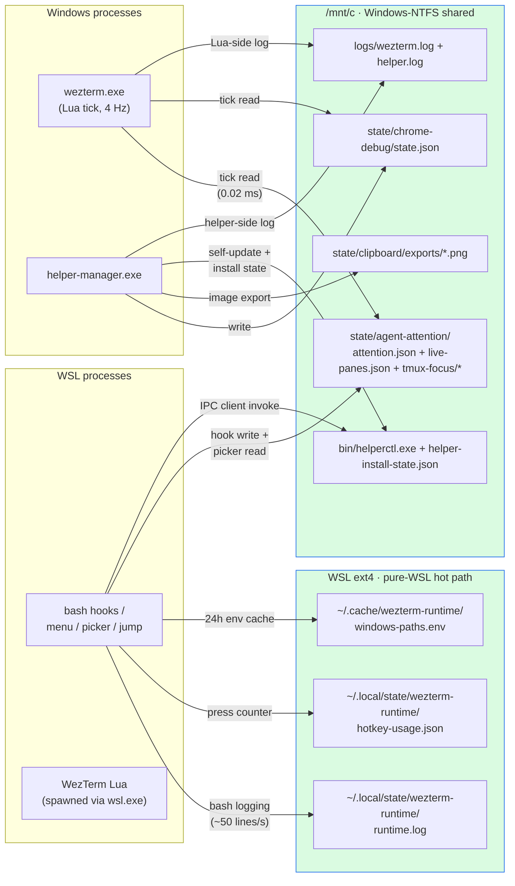

# Performance

Use this doc when the task is to investigate, validate, or change anything
on the Alt+/ attention-popup hot path, or when you need the cross-
filesystem routing rule for placing a new state file. It captures the
data that drove every decision in commits `1d099c8` and `789cbcf`, so
future "can we make this faster?" instincts have ground truth instead
of intuition.

## Why this surface matters

Alt+/ is the most-used chord in this configuration: a single day's work
typically fires it 50-100+ times because it is the eyes-on entry point
for the multi-agent attention pipeline (every "is anything waiting?"
glance routes through it). 100ms vs 50ms is the difference between
"feels snappy" and "feels sluggish" at that frequency, and the chord
sits on the critical path for several derived flows (`Alt+,` and `Alt+.`
share most of the same dispatch infrastructure; the worktree picker
re-uses the popup pattern).

The optimization arc documented here took p50 menu-prep time from
**545ms to 49ms** (11x) and produced a permanent measurement harness so
future regressions surface immediately.

## File catalogue

### Hot-path production code

The path a single Alt+/ press traverses, in order, with each owner's
performance contract.

| File | Role | Perf-relevant property |
|---|---|---|
| `wezterm-x/lua/ui/action_registry.lua` (`attention.overlay`) | WezTerm key handler. Walks mux → writes `live-panes.json` → forwards `\x1b/` to tmux | In-process, ~5ms |
| `wezterm-x/lua/attention.lua` (`write_live_snapshot`) | Atomically writes the pane snapshot before forwarding | `os.remove` + `os.rename` retry to work around Windows rename semantics |
| `tmux.conf` (`bind-key -n M-/`) | Forwards to the menu wrapper | tmux dispatch, ~5-15ms |
| `scripts/runtime/tmux-attention-menu.sh` | Reads state + builds row tuples + opens popup. Bench-instrumented via `WEZTERM_BENCH_NO_POPUP=1` | p50 49ms (was 545ms) |
| `scripts/runtime/windows-runtime-paths-lib.sh` | Resolves Windows `%LOCALAPPDATA%` etc. once + caches to disk | 24h TTL cache at `~/.cache/wezterm-runtime/windows-paths.env`; bypass with `WEZTERM_NO_PATH_CACHE=1` |
| `scripts/runtime/attention-state-lib.sh` | Reads attention state. Sources paths-lib once at lib-load, memoizes resolved path | All callers share one `__ATTENTION_STATE_PATH_CACHED` |
| `native/picker/main.go` | Subcommand dispatcher + shared helpers (perf log, term IO, shell escape). Hosts the `attention` subcommand. | ~2-5ms cold (vs ~30-80ms bash fallback) |
| `native/picker/cmd_command.go` | `picker command` — replaces `tmux-command-picker.sh`. Consumes a 6-field TSV menu.sh prefetched. | Skips ~50ms of `command_panel_load_items` re-run inside the popup pty |
| `native/picker/cmd_worktree.go` | `picker worktree` — replaces `tmux-worktree-picker.sh`. Consumes a 4-field TSV with `existing_window_id` already resolved. | Skips ~30ms of bash boot + render-lib source inside popup |
| `native/picker/bin/picker` | Compiled binary, gitignored | Provisioned by sync via local Go build or release-tarball fetch (see `build.sh` row); missing → bash fallback kicks in for whichever panel needs it |
| `scripts/runtime/tmux-attention-picker.sh` | Bash fallback for `picker attention` | Sources 3 libs cold |
| `scripts/runtime/tmux-command-picker.sh` | Bash fallback for `picker command` | Re-runs `command_panel_load_items` inside the popup pty |
| `scripts/runtime/tmux-worktree-picker.sh` | Bash fallback for `picker worktree` | Slurps a pre-rendered first frame to bound first-paint at "bash startup + 1 syscall" |
| `scripts/runtime/tmux-attention/render.sh` | Shared bash frame renderer (used by menu pre-paint + bash attention picker live re-render) | Single ANSI-positioned string, single `printf` flush |
| `scripts/runtime/tmux-worktree/render.sh` | Shared bash frame renderer for the worktree popup (menu pre-paint + bash picker re-render) | Same single-flush invariant |

### Build / sync infrastructure

| File | Role |
|---|---|
| `native/picker/build.sh` | Provisions the binary. Default `WEZTERM_PICKER_INSTALL_SOURCE=auto`: local Go build first (auto-discovers `go` from PATH / `~/.local/go/bin` / `/usr/local/go/bin`), then release-tarball fetch from `release-manifest.json` (sha256-verified, cached at `${WEZDECK_PICKER_CACHE:-$XDG_CACHE_HOME/wezdeck/picker}/<version>`), then silent skip. Force `local` or `release` via the same env var. Full semantics: [`picker-release.md#install-path`](./picker-release.md#install-path) |
| `native/picker/{go.mod, go.sum}` | Go module pinning `golang.org/x/term` |
| `skills/wezterm-runtime-sync/scripts/sync-runtime.sh` | Added `step=build-picker` between `render-tmux-bindings` and `copy-source` |
| `.gitignore` | Excludes `native/picker/bin/` (build artifact) |

### Diagnostic UI (temporary, slated for removal)

These exist while the Go picker and bash fallback run side-by-side.
Drop both once a bash-fallback fire becomes a defect rather than a
graceful degradation — i.e. once `native/picker/build.sh`'s `auto`
mode reliably provisions the Go binary on every supported host
through either the local-build or release-fetch path (see
[`picker-release.md#install-path`](./picker-release.md#install-path)).

| Surface | Purpose |
|---|---|
| `powered by go` (green, palette 108) / `powered by bash` (orange, 208) footer badge | Make the active code path legible at a glance during the parallel-implementation phase |
| `47ms = 8+22+17 (lua+menu+picker)` footer | End-to-end key→paint latency split into three buckets so any future regression is attributed to the right layer |

### Permanent measurement harness

The most valuable artifact — these are the tools you reach for the
next time anyone asks "can Alt+/ be faster?".

| File | Use when |
|---|---|
| `scripts/dev/bench-menu-prep.sh` | Microbenchmarking menu.sh's prep work in isolation. Sets `WEZTERM_BENCH_NO_POPUP=1` so the popup never opens — **does not disrupt your tmux**. Runs N iterations (default 30 + 5 warmup), reports min / p50 / p95 / max / mean per stage with deltas. Use for tight optimization loops. Pick the panel via `--target attention\|command\|worktree` (default `attention`); `command` and `worktree` need to run from inside an attached tmux client and use the current `#S` / `#{window_id}` / `$PWD` as the menu args. |
| `scripts/dev/bench-attention-popup.sh` | End-to-end validation via `tmux send-keys M-/`. **Will flash your popup N times** — for final acceptance, not iteration. Reads `category="attention.perf"` log entries the picker emits. |
| `scripts/dev/bench-wezterm-side-fs.ps1` | PowerShell harness measuring wezterm.exe-side file read latency: `%LOCALAPPDATA%` (Windows local NTFS) vs `\\wsl$\<distro>\…` (cross-boundary 9P). Definitively settles "should we move this state file to WSL ext4?" questions. Invoke from WSL via `windows_run_powershell_script_utf8`. |

### Perf-only logging

Each panel emits its own perf category — `attention.perf`,
`command.perf`, or `worktree.perf` — with `message="popup paint timing"`
(or `"command palette paint timing"` / `"worktree picker paint timing"`)
on every render. `perf-trend.sh --panel attention|command|worktree`
switches the category filter; default is `attention`.

Common structured fields:

```
paint_kind     "first" | "repaint"
picker_kind    "go" | "bash"
panel          "attention" | "command" | "worktree"
total_ms       end-to-end key → render
lua_ms         menu_start - keypress  (Lua handler + tmux dispatch + bash boot)
menu_ms        menu_done  - menu_start (jq + popup spawn prep)
picker_ms      render     - menu_done  (popup pty + picker init + first frame)
item_count     rows in the picker
selected_index 0-indexed cursor position at render time
```

Opt-in: `export WEZTERM_RUNTIME_LOG_CATEGORIES=attention.perf` in
`wezterm-x/local/runtime-logging.sh` to keep the noise out of the
default-on `attention` category. The bench harness reads these rows to
compute its stats.

## Decisions and the data behind them

Every decision in this round was measurement-driven. Future readers
should not re-litigate any of these without re-running the relevant
bench.

| Decision | Measured data | Choice | Where |
|---|---|---|---|
| Bash vs Go picker on the popup-pty side | Bash startup + 3 lib sources cold = 30-80ms; Go static binary = 2-5ms (~15-25x) | Go on the hot path, bash as fallback when binary is missing | `native/picker/`, `tmux-attention-menu.sh` dispatch |
| Cache the Windows env detection (`%LOCALAPPDATA%` / `%USERPROFILE%`) | Each Windows shell spawn from WSL ~100-200ms; menu.sh triggered detection 6+ times per Alt+/ → up to 600ms pure interop overhead | 24h disk cache at `~/.cache/wezterm-runtime/windows-paths.env`. Most savings of any single change | `windows-runtime-paths-lib.sh` |
| Hoist `windows-runtime-paths-lib` source from per-call to lib-load | Per-call source parsed ~150 lines × 3 calls per menu.sh run | Source once at `attention-state-lib.sh` load; in-process memo for `attention_state_path` | `attention-state-lib.sh` |
| Replace `date +%s%3N` with `EPOCHREALTIME` arithmetic | Each `date` fork = ~5ms; multiple stamps per menu.sh run | bash 5 builtins (`EPOCHREALTIME`, `EPOCHSECONDS`, `RANDOM`) for `start_ms`, `menu_done_ts`, and `trace_id`. `runtime_log_now_ms` itself now prefers `EPOCHREALTIME`, so every caller picks up the savings transparently. | `tmux-attention-menu.sh`, `tmux-command-menu.sh`, `tmux-worktree-menu.sh`, `runtime-log-lib.sh` |
| Drop `attention_state_init` from menu hot path | Init does mkdir + a /mnt/c stat for 5-10ms of pure cross-FS overhead with no value to a read-only caller | `attention_state_read` already returns empty JSON when the file is missing — init is for writers (hooks) only | `tmux-attention-menu.sh` |
| Drop the `jq -r '.entries | length'` count check | ~5ms cold jq spawn for redundant info — main pipeline already produces 0 rows on empty input, item_count short-circuit downstream catches it | Removed | `tmux-attention-menu.sh` |
| Merge `live_map`'s two jq calls (ts + panes) into one | Saves one cold jq spawn (~5ms) + one /mnt/c page-cache miss | Single jq emits both fields, U+0001 (SOH) delimiter, bash parameter expansion split | `tmux-attention-menu.sh` |
| Move `hotkey-usage.json` to WSL ext4 | Pure WSL bash writer + reader; /mnt/c was paying cross-FS penalty for nothing | Default path is now `${XDG_STATE_HOME:-$HOME/.local/state}/wezterm-runtime/hotkey-usage.json`; one-time legacy migration in the bump script | `hotkey-usage-lib.sh` |
| **Do NOT** move `attention.json` to WSL ext4 | wezterm.exe reads `/mnt/c/…` at p50 0.02ms; reading `\\wsl$\…` at p50 3.12ms (~150x slower). Lua tick = 4 Hz × ~3ms × N files = tens to hundreds of ms/sec wezterm CPU | Stay on /mnt/c. The bash menu.sh paying ~5ms per Alt+/ is much cheaper than the continuous tick cost | `bench-wezterm-side-fs.ps1` |
| **Do NOT** move `live-panes.json` to WSL ext4 | Per-Alt+/ tradeoff: Lua write +10ms vs bash read -5ms = net loss | Stay | Same |
| **Do NOT** move `tmux-focus/*.txt` to WSL ext4 | Same as `attention.json` — Lua reads on every tick × N tmux sessions | Stay | Same |

## The cross-FS routing rule

The catalogue and the wezterm-side bench together produce one rule
that should govern every future state-file placement decision:

> **A file belongs on WSL ext4 if and only if every reader and every
> writer is a WSL process AND the access frequency from WSL warrants
> the move.**
>
> If any consumer is a Windows process (wezterm.exe, helper.exe), the
> file lives on Windows NTFS so the Windows side reads/writes locally;
> WSL bash pays the ~5ms cross-FS penalty as the minority case.
>
> Even when both sides are WSL, do not move if the access pattern
> already hits the page cache nearly free (e.g. files read once per
> minute) — the migration code is also a cost.

The rule visualised against the current file inventory — direction of
each arrow is "the side that opens the file lives here, the side at
the other end pays the cross-FS penalty if it ever needs to read":



The yardstick that drives the rule: `wezterm.exe` reads `/mnt/c/…` at p50 **0.02 ms** vs `\\wsl$\<distro>\…` at p50 **3.12 ms** — a **~150× gap** measured by `bench-wezterm-side-fs.ps1`. With the Lua tick running at 4 Hz over `attention.json` + `live-panes.json` + N `tmux-focus/*` files, even a single migration to ext4 burns tens to hundreds of ms/sec of `wezterm.exe` CPU. Conversely, the bash menu paying a one-shot ~5 ms cross-FS read on Alt+/ is invisible because it only happens on keypress.

## Optimization techniques (replicable patterns)

These are the cross-cutting techniques the bench data validated. Reach
for them when optimizing any other shell hot path in this repo.

1. **Persistent disk cache for stable values.** Anything that requires
   spawning a Windows shell to read an env var should be cached with a
   long TTL. ~600ms savings per menu.sh.
2. **In-process memoization.** When the same expensive computation
   happens multiple times in one script invocation, cache to a global
   var on first call. ~10-20ms per duplicate.
3. **Source libs once at load time, not per-call.** Sourcing parses the
   whole file. Hoist `source` out of functions when the function is
   called more than once.
4. **bash 5 EPOCHREALTIME / EPOCHSECONDS builtins** instead of `date`
   subshells. Saves ~5ms per timestamp captured.
5. **Combine subprocess invocations.** One jq pass that emits multiple
   fields (delimited by SOH) beats N small jq calls. Same for tmux
   format strings: `'#{client_width}\t#{client_height}'` beats two calls.
6. **Drop hot-path work that early-exit paths don't need.** The
   `attention_state_init` and the redundant count-check `jq` were both
   speculative — the downstream path already handles their concerns.
7. **Use bash builtins instead of forking** for parsing: parameter
   expansion `${var%%delim*}` / `${var#*delim}` instead of `cut`/`sed`/
   `awk` for known-shape strings.
8. **Static binary in the popup pty.** When the consumer process is
   short-lived AND inside a popup (where pty creation already costs
   ~10ms), bash startup + lib sourcing dwarfs the actual work. A static
   Go binary cuts process startup from 30-80ms to 2-5ms.
9. **Pre-render the first frame upstream + slurp it with bash builtin
   `$(<file)`.** Eliminates fork+exec of `cat` on the first-paint path.
10. **`tmux run-shell -b` for fire-and-forget dispatch** so the popup
    closes BEFORE the slow downstream work runs — the user perceives
    the action as instantaneous even when it takes 50ms+ to complete.
11. **Single-pass session walk + per-path resolution cache.** When a
    prefetch loop needs to look up an existing tmux window for many
    candidate paths, do one `tmux list-panes -s` instead of N
    `list-windows`/`list-panes` round-trips, and memoize the expensive
    per-pane resolution (git rev-parse, etc.) by `pane_current_path` so
    duplicate panes only pay once. Saves O(N×panes) tmux + git forks at
    the cost of one assoc-array build. Pattern landed in
    `tmux_worktree_build_window_index` for the worktree popup
    (`prefetched_items` p50 54ms → 33ms with 1 worktree; scales linearly).
12. **Skip the bash-array intermediate when the consumer only needs TSV.**
    When a registrar lib exists to feed multiple consumers (e.g. a popup
    picker AND a runtime dispatcher), the popup's hot path can bypass the
    full registration walk — emit the picker-shaped TSV directly from one
    jq invocation that mirrors the registrar's eligibility filters. Keep
    the slow legacy walk reachable for users with extension hooks (here:
    `wezterm-x/local/command-panel.sh`); detect "extension active" with a
    cheap grep so the fast path is the default. Pattern landed in
    `command_panel_emit_picker_tsv` (`loaded_items` p50 52ms → 19ms; 168
    arg-parse calls + per-item eval collapsed into a single jq pass).

## What we explicitly did NOT do (and why)

These options were considered, costed, and rejected. Capturing them so
they don't get re-proposed without new evidence.

- **Move data prep entirely to Lua (lua-上移)** — would save ~30ms per
  Alt+/ by eliminating menu.sh's bash + jq cost, but requires keeping a
  Lua row-builder + Lua frame renderer in sync with the Go renderer
  (~150 lines of dual-implementation maintenance). At 49ms p50, total
  is below human-perception threshold (~50ms); the maintenance cost
  outweighs the perceptual benefit.
- **Long-lived picker daemon + IPC** — saves ~5-10ms more by skipping
  the binary exec on every press, but requires process lifecycle
  management, restart-on-crash, IPC protocol design. Diminishing
  returns.
- **Replace tmux popup with a wezterm overlay** — would skip popup pty
  spawn (~5-20ms), but wezterm's InputSelector hard-codes its cancel
  keys in `wezterm-gui/src/overlay/selector.rs` (no way to bind Alt+/
  as a toggle), which is the original reason we left InputSelector for
  tmux popup. Can't go back.
- **Migrate `attention.json` / `live-panes.json` / `tmux-focus/*` to
  WSL ext4** — see the cross-FS measurement above. Net loss because
  the Lua side reads on every tick.
- **Replace `jq` with pure bash JSON parsing** — fragile against
  arbitrary `reason` strings (user-controlled content from the agent),
  and the merged-jq optimization already cut jq cost to ~5ms total
  (under 10% of remaining latency). Not worth the correctness risk.

## Long-term observability

Every Alt+/ press already writes a structured `attention.perf` row to
`~/.local/state/wezterm-runtime/logs/runtime.log` — no extra setup
required. The data is enough to answer "did anything regress?" weeks
later without re-running benches.

### Schema

```
ts="2026-04-25 14:57:28.170" level="info" source="<script>"
  category="attention.perf" trace_id="..."
  message="popup paint timing"
  paint_kind="first|repaint" picker_kind="go|bash"
  total_ms="N" lua_ms="N" menu_ms="N" picker_ms="N"
  item_count="N" selected_index="N"
```

`ts` is millisecond-precision (see runtime-log-lib's EPOCHREALTIME
path) so events within the same Alt+/ press are ordered correctly.
`paint_kind="first"` is the per-press measurement; `repaint` rows are
Up/Down navigation and should be filtered out for first-frame stats.

### Trace ID propagation

The WezTerm `attention.overlay` Lua handler stamps a `trace_id` into
`live-panes.json` on every Alt+/ press. menu.sh reads it from the
snapshot, adopts it as `WEZTERM_RUNTIME_TRACE_ID`, and exports it so
the picker process inherits the same id. Result: a single id flows
lua → menu → picker → attention-jump.sh, and a single grep assembles
the full per-press timeline from both `runtime.log` (bash logs) and
`wezterm.log` (Lua logs):

```bash
trace='attention-20260425T145728-3835014-7695'
grep "trace_id=\"$trace\"" \
  ~/.local/state/wezterm-runtime/logs/runtime.log \
  /mnt/c/Users/Yuns/AppData/Local/wezterm-runtime/logs/wezterm.log
```

### Trend reporting

`scripts/dev/perf-trend.sh` reads the historical `attention.perf` rows
and reports trend / diff / live-tail views. Useful for "did this
change make things slower over the last week?" without re-driving the
bench harness.

```bash
# Daily p50/p95/mean for the last 7 days
scripts/dev/perf-trend.sh

# Side-by-side stage breakdown for two days
scripts/dev/perf-trend.sh --diff today yesterday
scripts/dev/perf-trend.sh --diff 2026-04-25 2026-04-18

# Per-event dump (for spotting outliers)
scripts/dev/perf-trend.sh --raw today | head -20

# Live tail — useful right after a code change to watch new presses land
scripts/dev/perf-trend.sh --watch

# Filter by code path (Go binary vs bash fallback)
scripts/dev/perf-trend.sh --picker-kind go
```

When investigating a regression, the typical flow is:

1. `--days 14` to spot when the p50 / p95 climbed
2. `--diff <good-day> <bad-day>` to see which stage (lua / menu /
   picker) drove it
3. `--raw <bad-day>` to see whether the regression is everything
   slowing down or a long tail of cold-start outliers
4. Re-run `bench-menu-prep.sh` to bisect the change

## Where to start a new optimization round

1. Run `scripts/dev/bench-menu-prep.sh --runs 30 --warmup 5 --label baseline`
   to get current p50 before touching anything.
2. Make one change. Re-run with `--label after-X`. If p50 didn't move
   by ≥ 5ms, revert — tighter thresholds are noise on this harness.
3. For end-to-end validation, run `scripts/dev/bench-attention-popup.sh`
   (will flash your popup, run when you're not actively using the
   terminal).
4. For cross-FS questions, run `scripts/dev/bench-wezterm-side-fs.ps1`
   via the windows-shell-lib UTF-8 wrapper.

## Cross-panel baseline (2026-04-25)

The same bench harness now covers all three popup panels — the column
to read is **prep p50**, which is everything menu.sh does up to (but
not including) `tmux display-popup`. Picker-side cost (popup pty +
bash boot + lib sourcing inside the popup + key loop) is on top.

| Target | prep p50 | Dominant stage | Notes |
|---|---|---|---|
| attention | ~23ms | `live_map` + `jq_rows` (~8ms + ~3ms) | Near the floor described above. Was ~31ms before the lingering `date +%s%3N` for `menu_done_ts` was inlined to `EPOCHREALTIME`. |
| command | ~30ms | `loaded_items` (~19ms) | Single jq invocation emits the picker's 6-field TSV directly (`command_panel_emit_picker_tsv`); the legacy bash-array build still runs only when `wezterm-x/local/command-panel.sh` has user-defined entries. Was ~73ms / ~52ms before the fast path landed. |
| worktree | ~68ms | `prefetched_items` (~33ms) | Single session-wide `tmux list-panes -s` + per-path git-resolve dedup, replaces N×`tmux_worktree_find_window`. Was ~110ms / ~54ms before `tmux_worktree_build_window_index` landed. |

The command palette and worktree pickers are next in line. Reach for
the same techniques the attention pipeline used (Go binary in the popup
pty, single jq pass, drop duplicate work between menu.sh and picker.sh,
combine subprocess calls). Re-run `bench-menu-prep.sh --target <name>`
after each change.

## Sync-runtime hot path

The Alt+/ sections above measure a frequent **interactive** chord. The other surface
that benefits from disciplined optimization is `skills/wezterm-runtime-sync/scripts/sync-runtime.sh`,
which is invoked **after every config edit** to publish the runtime tree from the
repo into the target home. It is not on the keypress hot path, but a slow sync is
felt every iteration cycle when actively editing the repo.

The arc here took warm-state sync from **~60s to ~700ms (~85×)**, and the decisions
follow the same patterns as the Alt+/ work: measure before changing, parallelize
independent work, skip what hasn't changed, and treat `/mnt/c` writes as expensive.

### Wall-time milestones

Each row is a separate change layered on top of the previous. Numbers are warm-state
median wall time (no source changes since last sync, helper-manager already running):

| State | Wall time | Headline change |
|---|---|---|
| Original | ~60s | Two `&`-parallel flows (runtime+native vs bootstrap), but deps-check ate ~40s sequentially after `step=completed` |
| Subflow split | ~60s | runtime + native now have their own parallel sub-chains inside `run_runtime_native_flow` (render-tmux-bindings + rsync runtime + write metadata, in parallel with picker build + rsync native). Bottleneck still in deps-check. |
| Postsync parallel | ~60s | tmux-reload + setup-vscode-links + check-deps-updates run concurrently with output captured to temp files and replayed in stable order. Still capped by deps-check's ~40s network probes. |
| deps-check fire-and-forget + daily | ~17.5s | `nohup ... &` + `disown`, redirect to a per-target log, gate next runs on log file's mtime date. Never waits on the network again. |
| rsync direct → target | ~4.2s | Replaced `cp -R source → temp` + `rm -rf old target` + `mv temp → target` with `rsync -a --delete source → target`. Eliminates the cp's full-tree write and the slow `rm -rf` on `/mnt/c`. |
| helper-install skip-if-current | ~1.1s | mtime check on `host-helper/windows/src/**` vs `helper-install-state.json` skips the ~1-1.5s `dotnet publish` round-trip when nothing changed. |
| helper-ensure skip-if-running | ~0.95s | Parse `state.env`, check `ready=1` + state.env mtime fresh + no runtime file newer than state.env → skip the ~400-500ms PowerShell round-trip. |
| picker / render / lua-precheck idempotency | **~0.7s** | Picker `go build` skipped if binary is at least as new as every `*.go`/`go.mod`/`go.sum`. `render-tmux-bindings.sh` writes via temp + `cmp` + rename so identical output never bumps the file's mtime. `lua-precheck` touches a sentinel on success; rerun gated by `find -newer` on `lua/` + `repo-worktree-task.env` + the precheck script. |

### Decisions and the data behind them

| Decision | Measured data | Choice | Where |
|---|---|---|---|
| `cp -R` vs `rsync -a` to `/mnt/c` | cp always writes every byte (hundreds of files × ~1ms 9P round-trip per write) + the old flow's `rm -rf` of the previous target adds another full-tree delete | Switched to `rsync -a --delete` direct to target. **Lost** dir-tree atomicity (rsync is per-file atomic via temp+rename, but mid-sync the tree is briefly mixed). Acceptable: sync is a user-initiated action, wezterm/tmux are typically idle, and the worst-case window is sub-second. | `prepare_runtime_subflow`, `prepare_native_subflow` |
| Block on deps-check vs detach | deps-check spends ~40s waiting on GitHub release API + go.dev. None of its output is needed for sync to succeed. | `nohup ... &` + `disown`; output to a per-target log; **rate-limit to once/day** by checking the log's mtime date against today. | `sync-runtime.sh` (top-of-flow detach block) |
| mtime gate vs `go build`'s own incremental | `go build` is incremental but still spawns the toolchain (~150ms warm). | Add a `find -newer` shortcut around the build invocation. The mtime check is ~30 syscalls (~30ms on `/mnt/c` only if sources lived there; here sources are on Linux ext4 → microseconds). Layered: our gate avoids the ~150ms fork cost in the steady case; Go's content-hash cache covers the unusual case where mtime updated but content didn't. | `native/picker/build.sh` |
| Re-render chord-bindings every sync vs idempotent write | The renderer always wrote to `OUT` even when content was identical, bumping mtime. Downstream skip-checks (lua-precheck, helper-ensure) compare against runtime file mtimes — any unnecessary mtime bump makes them invalidate. | Write to `OUT.tmp.$$`; `cmp -s` against `OUT`; on match, `rm` the temp; on diff, `mv`. Output mtime now tracks "last real binding change". | `scripts/runtime/render-tmux-bindings.sh` |
| Helper state file: heartbeat field vs FS mtime | state.env carries `heartbeat_at_ms` (Windows clock) and is touched on every heartbeat. WSL `date '+%s'` and Windows clock skew by ~250ms in steady state. Comparing epoch-ms naïvely (`age_ms = now_ms - heartbeat_ms; age_ms >= 0`) fires false-negatives whenever Windows is ahead. | Use `stat -c '%Y' state.env` (FS mtime, consistent with `find -newer` we run on the same filesystem) + a wide `[-5s, +10s]` window. | `helper_ensure_skip_if_running` |
| state.env line-ending parsing | PowerShell writes CRLF. `read -r key value` leaves `\r` on `$value`, so `[[ "$ready" == "1" ]]` fails when actual content is `1\r`. Subtle: this hid the heartbeat-fresh skip behind a CRLF bug for one debug iteration. | `value="${value%$'\r'}"` after each read. | `helper_ensure_skip_if_running` |
| Preserve metadata-file mtimes via `cp -p` | sync writes `repo-worktree-task.env` into the target via `cp` every run. Without `-p`, target mtime is "now" each sync, which would make every lua-precheck rerun. | `cp -p` so target mtime tracks source. The lua-precheck gate then only fires when the user actually edited `config/worktree-task.env`. | `prepare_runtime_subflow` |

### Optimization techniques (replicable patterns specific to sync-runtime)

13. **mtime as a "did anything change since X?" oracle.** When you have a known-good
    state file (install state, sentinel, log), use its mtime as the reference and
    `find $INPUTS -newer $REF -print -quit` to detect changes early. `-quit`
    ensures the worst case is one full tree walk on the unchanged path, but the
    common case exits on the first hit.
14. **Detach work that doesn't gate completion.** If a step's output isn't needed
    for sync to succeed (advisory checks, deferred reports), `nohup`+`disown` it
    and let it run past the script. Combine with a daily-rate-limit so you don't
    pile up duplicate background jobs across rapid syncs.
15. **`rsync -a` instead of `cp -R` whenever target may already exist.** rsync's
    "skip unchanged file" beats cp's "always write" by orders of magnitude when
    the target FS is `/mnt/c`. The atomicity downgrade (per-file vs whole-tree)
    rarely matters for user-initiated, infrequent syncs.
16. **Idempotent generators (write-on-diff)** preserve mtime-based skip chains.
    Any script that writes to a tracked file should `cmp` against the existing
    target before replacing — otherwise it cascades into invalidating every
    downstream `find -newer` gate.
17. **Stat-based time, not clock-based.** Cross-OS clock comparisons (WSL vs
    Windows) drift ~100-300ms steady-state. Use `stat -c '%Y' file` so the
    timestamp comes from the same filesystem clock both readers/writers observe.
    Same trick: `find -newer file` instead of `(date +%s) - (stat +mtime)`.

### What we explicitly did NOT do (and why)

- **Move temp+rename publish back in for tree-level atomicity** — the original
  flow's `cp source → temp; rm -rf target; mv temp → target` was atomic at the
  tree level, but cost ~16s warm because of cp's full write + rm-rf's full delete
  on `/mnt/c`. The rsync direct-write path costs ~700ms. Atomicity loss is
  practically invisible: nobody reloads wezterm or tmux mid-sync.
- **Skip `dotnet publish` from the bash side via source hash** — the existing
  mtime gate is "good enough" (false-positive only when someone `touch`-es
  unchanged source, which is rare). A content hash would mean reading every .NET
  source on every sync (~10ms vs ~1ms for a single `find -newer`), trading a
  cheap stat for a more expensive read.
- **Long-lived sync daemon** — would shave the bash startup (~50-100ms), but
  introduces process lifecycle, restart-on-crash, and IPC. Not worth it under
  1s warm.
- **Pure-bash JSON parsing of state.env / helper-install-state.json** — both
  files have predictable layouts and we already parse them with `read` (no jq
  needed). The bash parsing adds ~0ms compared to spawning jq.

### Floor and what's left

Remaining ~700ms is dominated by physical limits of `/mnt/c` interaction:
- ~50-100ms bash startup + sourcing the new lib files (`sync-helper-windows-lib.sh` + `sync-target-lib.sh`)
- ~200-300ms parallel rsync of unchanged trees (still has to stat every file to confirm "nothing changed")
- ~150-300ms lua-precheck spawn when its gate fires (rare)
- ~150-300ms tmux-reload + vscode-links concurrent step
- ~50ms rest

Going below ~500ms would need either a long-lived daemon or rsync replacement that
bypasses the per-file stat round-trip on /mnt/c — both are large complexity bumps
for diminishing returns at this scale.

## Floor reached

Remaining ~49ms p50 is dominated by physical limits:

- ~6ms cat of `attention.json` from `/mnt/c` (page-cache warm)
- ~12ms read + jq of `live-panes.json` from `/mnt/c`
- ~5ms main jq pipeline (already a single invocation)
- ~5ms tmux geometry probe + frame pre-render

Going below ~30ms requires either moving the high-tick state files
(net loss per measurements) or eliminating the bash menu layer entirely
(maintenance loss). Both rejected with data above.
