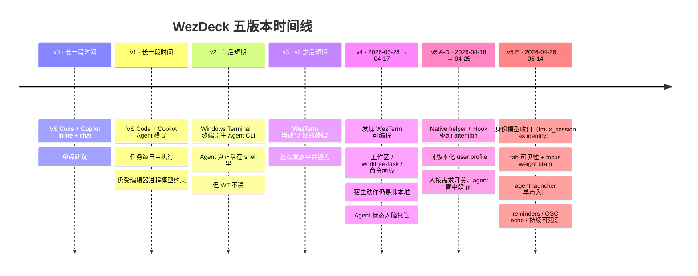
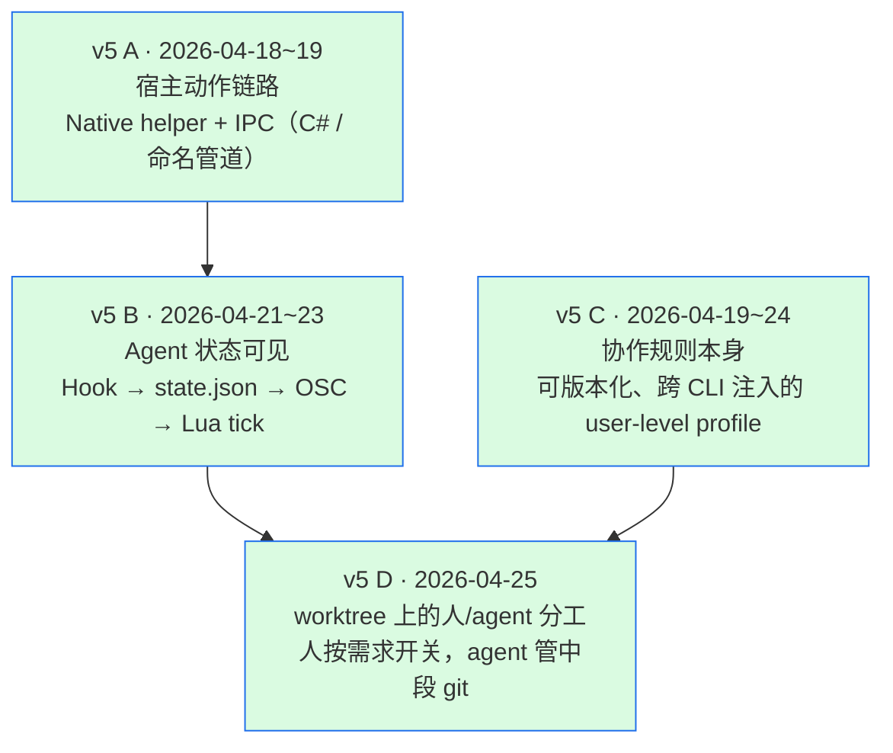

# WezDeck 的演进 —— 从 Copilot 聊天到 multi-agent 驾驶舱

> **三篇导航**：本篇是 **"为什么会走到这里"** 演进 + 反思篇（30 分钟）。想 10 分钟看懂这套环境**现在**长什么样 → [outline](./ai-workspace-sharing-outline.md)。想看作者前端视角的 personal reflection → [v1.0](./personal-terminal-platform-v1.0.md)（8 分钟）。

## 一句话定位

这套环境的主线不是"折腾终端"，而是：

> **AI 编码助手的形态每变一次，都逼我把工作环境往前推一格。**

每推进一格，就接近 WezDeck 现在的形态：一个 multi-agent 驾驶舱。

---

## 演进时间线



每一格的"触发"都不是工程灵感，而是**当前 AI 形态在当前环境下显出的具体不爽**：单点建议→不能跨文件 → Agent 模式；编辑器内 agent→不能多 pane 并行 → CLI；CLI 在 WT 不稳 → 换 WezTerm；WezTerm 只是终端 → 把它当平台用；脚本堆住宿主能力 + 任务状态散在脑里 → 跨进程统一控制面 + Hook 驱动的 attention pipeline。

---

## v0 — Copilot inline 补全 + 聊天

**形态**：VS Code 里 Copilot 同时承担两个角色 —— 光标处的 tab completion 和侧边栏 chat。AI 已经在真正写代码，但粒度是"它提议 → 我接受"。

**够用的部分**：第一次把 LLM 拉进日常编辑流程。样板代码、单段逻辑、改写建议这种**单行/单块**粒度上 Copilot 极强。

**触发下一步的痛点**：

- 跨文件改动要人脑搬运 —— 重命名一个被 20 个文件引用的函数？Copilot 只在当前光标位置帮忙。
- 没有任务粒度 —— 修一个 bug 要在十来个位置依次"Tab 接受 → 小改 → 继续"。
- 跨工具协作全靠人搬上下文 —— 测试跑红，错误栈从终端 copy 到 chat、得到建议、贴回编辑器，**三次上下文搬运换一次建议**。

---

## v1 — Copilot Agent 模式（在 VS Code 里跑了很久）

**触发**：Copilot 推出 Agent 模式 —— AI 不再局限于"接受补全"或"侧边栏回答"，可以**自主跨文件读、改、跑 task、拉 terminal**。从"单点建议者"升级为"任务级执行者"，但全部仍发生在编辑器里。

**形态**：仍以 VS Code 为中心，但 Agent 可以连续执行多步。重构、批量改写、按描述生成、跑测试修 bug —— 大量任务从"我读建议 / 手动采纳"变成"它动手 / 我审查"。

**这阶段持续时间很长**，远比预期长，因为它**显著提高了产出**，迁移成本看起来不划算。

**触发下一步的痛点**（注意：不是 VS Code 做不到，而是按哪个模型做）：

- **Agent 的操作契约是编辑器 API 级，不是 shell 级**。和 `fzf` / `tmux send-keys` / `watch` / 自定义 shell 函数自然拼起来始终隔着一层 `runInTerminal` 抽象 —— 同一件事在 tmux 里是一个 pipe，在编辑器里是一个 tool call。
- **Agent 的终端是 panel 里的子 UI，不是 tmux 里和我平等的 pane**。想并排推三四个独立 Agent 任务，底部 panel 切换成本太高；在 tmux 里这就是 4 个 pane 的事。

---

## v2 — Agent CLI 回到终端（Windows Terminal）

**触发**：年后，终端原生 Agent CLI 形态成熟（Claude Code / Codex CLI 等）。它们天然活在 shell 里、不受编辑器布局束缚、和 Git/tmux/OS 工具链距离更近。**交互主场从编辑器反向回到终端。**

**形态**：直接在 Windows Terminal 里开 Agent CLI session。AI 和我共用同一条 shell。多任务、多项目、多分支并行第一次成为可能。

**触发下一步的痛点**：

- WT 对长会话 / 高频重绘并不舒服（[microsoft/terminal#19772](https://github.com/microsoft/terminal/issues/19772#issuecomment-3790206055)） —— Agent CLI 跑到一半 UI 卡住、输出错位、必须强关 tab 重开。
- 没有工作区、没有状态持久化 —— 三件事开三个 tab，靠 tab 标题肉眼辨认；窗口一关全没；切回来要重新 cd / 启 Agent / 贴上下文。

---

## v3 — 迁移到 WezTerm（仍只是终端替代）

**形态**：只换终端，其它不变。当时对 WezTerm 的认知停留在"更稳、Unicode 规范、性能好"。

**够用的部分**：Agent CLI 场景下的稳定性问题解决了。

**为下一步埋的伏笔**：注意到了 WezTerm 的配置是 Lua —— 但还没意识到这意味着什么。

---

## v4 — 把 WezTerm 当平台用（2026-03-28 → 04-17）

**触发**：意识到 WezTerm 配置是**编程式的**。既然能编程，那就不只是终端 —— 它可以是个人工作平台的宿主。这个认知转变是 WezDeck 真正开始的时刻。

**这段做了什么**：

- **平台骨架**（[`44ac488`](https://github.com/yunsii/wezterm-config/commit/44ac488) 开张 + 之后一周）—— WSL workspace、runtime mode、launcher profile 抽象成形。
- **工作区与多任务**（3 月底 4 月初）—— `worktree-task` 第一次把"一个任务 = 一个分支 + 一个目录 + 一个 tmux 会话"绑起来。
- **贴图处理**（[`eb2d8ea`](https://github.com/yunsii/wezterm-config/commit/eb2d8ea) `fix(ui): cache smart image paste in a background listener`）—— 把图片粘贴从同步脚本做成后台 listener 缓存，这是第一段"不只是脚本，是长生命周期辅助进程"的雏形。
- **命令面板出现**（[`2487ae1`](https://github.com/yunsii/wezterm-config/commit/2487ae1)）—— 但任务状态仍是人脑托管的：切回哪个 workspace、进哪个 pane，都要自己记。
- **AI Agent 作为一等公民**（[`5410c67`](https://github.com/yunsii/wezterm-config/commit/5410c67) + 后续）—— launcher profile 统一、managed commands 走 login shell、第一份分享 outline ([`52e1102`](https://github.com/yunsii/wezterm-config/commit/52e1102)) 上线 ——"我开始意识到这是一个平台"的时间戳。

**触发下一步的痛点**：

- 宿主动作仍是 PowerShell 脚本堆。Alt+O 聚焦 VS Code 每次冷启 `powershell.exe`，几百毫秒到一秒才响应；连续按几下还会互相打架。
- Agent 的**真实状态**对平台不可见 —— 同时让四个 Agent 跑，想知道哪个等我答复，只能一个个切 pane 扫屏，**切过去才发现它十分钟前就停在"是否继续？"**。

这两个痛点直接定义了 v5 的两条主线：宿主链路统一 + Agent 状态可见。

---

## v5 — Native Helper + Hook 驱动（2026-04-18 起）

v5 不是一次跃迁，是**四条独立但互相依存的收口**。它们的层次：



A 是物理层（让宿主能力变成"一个请求"），B 是控制层（让 agent 状态变成"一条流水线"），C 是契约层（让协作规则变成"可版本化的资产"），D 是工作流层（把 A/B/C 收益落到 worktree 这条载体上）。

下面分别讲。

### v5 A · Native Helper（2026-04-18 → 04-19）

Windows 侧从"每次调用都起一次 PowerShell"升级为**长期存活的 C# helper + 命名管道 IPC**。宿主能力（VS Code 打开 / Chrome 调起 / 剪贴板 / 通知）不再是脚本堆，而是走 `helperctl → IPC → helper-manager.exe` 的**统一请求路径**，并且 helper **可构建、可发布、可升级、可回退**。带 `trace_id` 的请求让 helper 端 `helper.log` 和 wezterm 端 `wezterm.log` 用同一个 id 关联，单条 grep 就能拼端到端时间线。

具体形态（含 IPC 时序图、典型延迟、reuse policy）见 [outline §核心特性 4](./ai-workspace-sharing-outline.md#4-native-host-helper--让宿主能力变成一个请求)；代表 commit：[`1c62402`](https://github.com/yunsii/wezterm-config/commit/1c62402)、[`1b538da`](https://github.com/yunsii/wezterm-config/commit/1b538da)、[`e79ae01`](https://github.com/yunsii/wezterm-config/commit/e79ae01)。

### v5 B · Agent Attention Pipeline（2026-04-21 → 04-23）

平台开始**消费 Agent CLI 的 hook 事件**，主动把任务状态推给我 —— 而不是等我巡检。`UserPromptSubmit → running`、`Notification → waiting`、`Pre/PostToolUse → resolved`、`Stop → done`、`SessionStart(matcher:clear) → pane-evict`，加上 OSC 1337 `attention_tick` 实时唤醒 Lua tick re-render —— 一条 hook → 状态文件 → OSC → Lua → 徽章渲染的链路。

具体形态（一回合 8 步 sequence diagram、focus-based auto-ack 的 `--only-if-ts` 时序、`Alt+,` / `Alt+.` / `Alt+/` 分工）见 [outline §核心特性 1](./ai-workspace-sharing-outline.md#1-跨-pane-的-agent-attention-流水线)；代表 commit：[`ce60661`](https://github.com/yunsii/wezterm-config/commit/ce60661)（核心）、[`f2eac78`](https://github.com/yunsii/wezterm-config/commit/f2eac78)、[`718e026`](https://github.com/yunsii/wezterm-config/commit/718e026)。

**这段的本质**：平台第一次拥有"Agent 端的事实视图"。哪个 pane 的 Agent 在跑、在等我、跑完了，全部由 hook 推来。多任务并行的"人脑调度成本"从这里开始被真正摊掉。

### v5 C · User-Level Agent Profile 基础设施（2026-04-19 → 04-24）

A 收口宿主链路，B 收口 Agent 状态。C 收口的是**协作规则本身** —— 把过去在每次对话里反复复述的"验证纪律 / 授权边界 / 工具使用节奏 / VCS 硬底线"等用户级共识，固化为一个**可版本化、跨 agent 家族自动注入**的契约层。

转折点：

- [`f62233c`](https://github.com/yunsii/wezterm-config/commit/f62233c) `agent-profiles/v1/` 版本化目录诞生，profile 作为独立资产，不再散在 `CLAUDE.md` 里。
- [`34e23e4`](https://github.com/yunsii/wezterm-config/commit/34e23e4) 每条规则拿到 `[topic-NN]` 稳定标识符；feedback、memory、交叉引用都用 ID 精确锚定，不再模糊复述。
- [`30b0b01`](https://github.com/yunsii/wezterm-config/commit/30b0b01) `feat(agents): auto-link user profile into ~/.claude and ~/.codex`。入口 + 11 个 topic 一次性镜像到两种 host 的配置根。**此前只镜像入口一个文件，里面的 `./validation.md` 等相对路径在外部目录解析不到，规则整两天没实际生效** —— 修复的直接触发点是"使用上觉得不对劲来排查"。
- [`a932582`](https://github.com/yunsii/wezterm-config/commit/a932582) + [`51802b2`](https://github.com/yunsii/wezterm-config/commit/51802b2) 对照 2026 年公开的 AGENTS.md 实践（OpenAI、Anthropic、GitHub 2500+ repo 统计），补齐 `secrets.md` / `Untrusted Input` / `Subagent Briefing` / 安全闸门绕过授权 等共识。

**这段的本质**：**协作规则从"对话里复述"升级为"目录里的资产"**，跨 Claude / Codex 自动注入，规则修一处两边都生效。

### v5 D · Worktree 工作流（2026-04-25）

A/B/C 各自收口一类子系统。D 收口的是**人和 agent 在 worktree 这条载体上的分工**：

> **人只做两端：按需求类别快速创建一个 worktree，需求结束后快速回收。**
> **中间的分支命名、checkout、commit、rebase、PR、合并校验，全部交给 agent 在那个 worktree 里管。**

```
人（端点 1）            agent（中段）              人（端点 2）
Ctrl+k g {d,t,h}    →  分支 / commit / rebase /  →  Ctrl+k g r
快速开一个需求类别       PR / 合并校验 / 续接对话      需求结束安全回收
```

三种前缀对应三种心智模型，按下 hotkey 的那一刻就声明了"这是哪一类需求"：`g d` → `dev-<slug>`（长寿工作站，几周到几个月）、`g t` → `task-<slug>`（PR-scoped，几小时到几天）、`g h` → `hotfix-<slug>`（紧急修复）。reclaim 内部三道闸门把关：refuse 主 worktree、refuse `dev-*`、refuse 脏树、只在 task 分支已 merge 进主 worktree HEAD 时才删除 —— 人按下 `Ctrl+k g r` 不需要回忆"这条分支合了没 / 树干干不干净 / 是不是 dev-"。

具体形态（lifecycle stateDiagram、reclaim 闸门细节、`<base>-resume` profile 解析链）见 [outline §核心特性 2](./ai-workspace-sharing-outline.md#2-跨-worktree-的统一驾驶视图)。

中段 agent 拿到的是干净起点（`origin/HEAD` 为 base）+ 长期续接的对话（[`f6577f5`](https://github.com/yunsii/wezterm-config/commit/f6577f5) 让每条会创建或刷新 agent pane 的路径都走 `<base>-resume`）。**切回 `dev-foo` 就接着上次没说完的话往下走、`git status` 是它自己留下的、commit message 也是它自己写的**；切到 `task-bar` 就是另一段对话、另一份历史。

**这段的本质 + 与 A/B 合流的效果**：worktree 升级为 **"需求 → agent 工作上下文 → 合并 → 回收"** 的全周期载体。和 attention pipeline（B）合流后，多任务从 v5 上线时的"开得起来 / 管得过来"再前进一步到"**人按需求开关、agent 在中段独立推进**"。人的认知带宽不再花在 git 流程上，只花在"开哪一类需求"和"这个需求结束没"上。

**隐性收益 · CLI 无关性**：A/B 的直接收益是单 agent（Claude Code）流畅度；C 带来跨 CLI 的一致性 —— 同一套规则同时作用于 Claude / Codex；D 把这种跨 CLI 延伸到 worktree 体验：resume 字符串按 `WT_PROVIDER_AGENT_PROFILE_<UPPER>_RESUME_COMMAND` 收一处。**未来再出新的终端 agent，接入成本退化为"在 env 里加一行映射"**。

### v5 E · 上线之后的持续维护（2026-04-26 → 05-14）

A/B/C/D 是四根主柱；E 不是新柱，是**主柱上线后跑出来的连续维护与后段细化**。在真实 multi-agent 工作流跑了两三周以后，几条原本被掩盖的成本开始浮出来 —— 解决方式都遵循前面四柱的同一种模式：找出隐性认知开销、把它变成平台可以代为承担的链路。

#### E1 · 身份模型收口（2026-04-29）

attention 流水线最初把 wezterm tab + pane 揉进了 entry 身份里：upsert 用 `(socket, tmux_pane)` evict、label 烤进 wezterm `tab_index`、overflow tab 轮转时旧 session 的 entry 在 TTL 之前一直挂着。在 hot reorder 频繁、refresh-current-window 频繁、overflow 旋转频繁的真实使用下，"pane 是身份"的隐含语义和"session 是任务"的真实语义对不上号 —— 同一个 agent 任务被 refresh 一下 pane id 就换了，attention 里就多出一条幽灵 entry。

[`d150a5d`](https://github.com/yunsii/wezterm-config/commit/d150a5d) `refactor(attention)!: anchor pipeline on tmux_session as identity` 把这条边界翻过来：**entry dedup key = `(tmux_socket, tmux_session)`，wezterm tab/pane 只是渲染槽 + 诊断字段**。配套 [`727eb67`](https://github.com/yunsii/wezterm-config/commit/727eb67) 让 `recent[]` 的墓碑按 pane 折叠（一条 pane 多次状态翻转只留最新一条），[`1117b2d`](https://github.com/yunsii/wezterm-config/commit/1117b2d) 让 dedup key 也限定在同一 tmux pane 内。三个 commit 合起来，overflow 轮转、reachability sweep、tmux session-closed hook 各自走干净的"归档进 recent[]"路径，不再依赖 pane-id 这种生命周期短的标识。

#### E2 · Tab 可见性 brain（2026-04-26 → 04-29）

v5 B 让"哪个 agent 在等我"变得可见；v5 E2 让"哪些 session 该被 tab strip 显示"也变得可见。机制和 B 同构：focus 信号是来源，文件状态是中介，wezterm 端只渲染。具体形态见 [outline §核心特性 2.1](./ai-workspace-sharing-outline.md#21-tab-可见性--focus-weight--让在做的自动浮上来)；代表 commit：[`24897d5`](https://github.com/yunsii/wezterm-config/commit/24897d5)（首个 visible-cap + overflow）、[`b3928e1`](https://github.com/yunsii/wezterm-config/commit/b3928e1)（cross-workspace `Alt+x` picker）、[`9821d9d`](https://github.com/yunsii/wezterm-config/commit/9821d9d)（picker 和可见 tab 都改吃 focus weight）、[`941c744`](https://github.com/yunsii/wezterm-config/commit/941c744)（`Alt+/` 与 `Alt+x` 布局对齐）。

**和 v5 B 共享的隐含模式**：人在做这件事的认知开销 → 看 hook 信号能不能代为承担 → 用同一种"状态文件 + 渲染端拉"的链路接上。从"该看哪个 agent"扩展到"该看哪几个 session"，B 和 E2 的成本结构和实现成本几乎一致。

#### E3 · agent-launcher 单点入口（2026-05-06）

v5 的 4 条 agent CLI 启动路径（workspace 首开、`Alt+g` 即开窗、refresh-current-window、tab-overflow 冷 spawn）历史上各走各的 shell chain —— 只有第一条会经过 zsh 的 rc，导致 `~/.zshrc` 导出的 secret（`CNB_TOKEN` 等）在另外三条路径上看不见，agent Bash 里 `npm view @coco/x-server` 出 401，用户的交互 shell 却没事。

[`fa779f0`](https://github.com/yunsii/wezterm-config/commit/fa779f0) `feat(agents): unify launch chain via agent-launcher and shell-env.d` 把 4 条路径全部收敛到 `scripts/runtime/agent-launcher.sh`，由它唯一一次 source `runtime-env-lib.sh::runtime_env_load_managed` 再 exec agent。配套把"用户级 secret"的约定也明确下来 —— 直接丢一个文件进 `~/.config/shell-env.d/<name>.env`（mode 600），loader 和 `~/.zshrc` 都自动发现，新增 secret 不用再改任何 rc 文件或 loader 列表。

**和 v5 A 共享的模式**：v5 A 收的是宿主链路（脚本堆 → IPC 单点）；v5 E3 收的是 agent 起点（4 条 shell chain → launcher 单点）。两条都是"把脚本堆压成一个收口点"的同构操作。

#### E4 · Reminders pipeline（2026-04-26）

[`05518e4`](https://github.com/yunsii/wezterm-config/commit/05518e4) `feat(reminders): add tmux-popup cron pipeline` 加了一条很小的新管道：cron → `scripts/runtime/reminder.sh` → `scripts/runtime/tmux-popup-active.sh`，popup 落到最近活跃的 tmux client 上、阻塞到按键为止（**故意不带 timeout** —— reminder 自动消失就等于没看到）。

**为什么不复用 attention pipeline？**两者解决的是相反的问题：attention 的 badge 是"glanceable but easy to miss"，专门给 agent turn 用；reminder 要的是"interrupt heads-down work"。把 cron-driven 提醒混进 `🚨 N waiting` 计数会稀释 attention 的语义；让 attention 学会"打断"又会让所有 agent waiting 都打断 —— 两者正交，分开做。详见 [`docs/reminders.md`](../reminders.md)。

#### E5 · 持续可观测（贯穿 04-26 → 05-14）

E 段还产出一组**没单独成柱、但 cumulative 重要**的可观测性补强：

- [`367128d`](https://github.com/yunsii/wezterm-config/commit/367128d) `feat(agents): emit attention.tick.echo sidecar for OSC drop diagnosis` —— 每次 hook 触发都额外写一份 echo sidecar，OSC 1337 走丢时 Lua 端用 file-watcher 兜底，事故回放也能在 echo 序列里离线对账。
- [`2011146`](https://github.com/yunsii/wezterm-config/commit/2011146) `perf(attention): drop per-tick state reload, fire only on attention.tick event` —— attention 状态由轮询改成事件驱动；空闲时 wezterm tick 不再吃 IO。
- [`4ce90f4`](https://github.com/yunsii/wezterm-config/commit/4ce90f4) `feat(attention): nudge wezterm tick after state writes + event-bus rationale` —— OSC + file 两条传输通道共存的决策（见 [`docs/event-bus.md`](../event-bus.md)）。
- 几条 split-pane / tab-overflow / chrome-debug 的精度修复（[`bd1fad8`](https://github.com/yunsii/wezterm-config/commit/bd1fad8)、[`8d33bcd`](https://github.com/yunsii/wezterm-config/commit/8d33bcd)、[`9f0f98d`](https://github.com/yunsii/wezterm-config/commit/9f0f98d)）—— 真实使用里冒出来、原模型没考虑到的边缘情形。

**E 段的本质**：v5 上线时各柱"能跑"；E 段把它们做到"跑得稳、跑得能 trace、跑得在边缘情形下也不掉链子"。**这条曲线大概率永远不会停**，写在叙事里是为了承认：平台不是"四柱立起来就完事"，是"四柱立起来之后还得维护两三周才真正长在工作流里"。

---

### 配套：让 D 这条分工"跟得上手"

D 节描述的是**分工设想**；要让人愿意一天里反复按 `Ctrl+k g {d,t,h,r}` 和 `Alt+g`，picker 必须像快门、闪烁必须从视野里被消掉。这里两件事并发推进：

**Popup picker 11× 性能优化**（30-80ms → 2-5ms）：prefetch + 单帧渲染消除"白屏 → 列加载 → 列出现"的两三帧、`tmux run-shell -b` 让 popup 关闭和窗口创建解耦、[`56db244`](https://github.com/yunsii/wezterm-config/commit/56db244) 把 popup 主体换成静态 Go binary。性能不是单点 commit，是带 observability 的产品契约：每次按 `Alt+/` 都会写一条 `attention.perf` 结构化 log，`scripts/dev/perf-trend.sh --diff today yesterday` 直接出趋势图。详细决策与 bench 数据：[`docs/performance.md`](../performance.md)。

**04-25 当天消掉的几类视觉噪音**：

- **输入法候选框闪烁**（agent CLI 高频重绘下打中文）—— 根因是 wezterm IME 路径不门控 synchronized-output 状态。tmux 3.4 把 BSU/ESU 当 unknown CSI 透传，sync 窗口能卡死外层。**tmux 3.6 才把 BSU/ESU 变成自己的 batching driver**（带 1 秒 ESU flush 兜底）。[`fe4491e`](https://github.com/yunsii/wezterm-config/commit/fe4491e) 把 tmux 3.6+ 设为本仓库底线。详细排查见 [`docs/ime-flicker-and-sync-output.md`](../ime-flicker-and-sync-output.md)。
- **popup pty 首帧白闪** + **裸 Esc 半秒不响应** + **selected row 反白闪烁** + **状态栏行宽抖动** —— 一组细碎的视觉摩擦，每条单独看都微小，叠在一起就让"切回去就接着说"那条分工感官上立不住。一一消掉。

**一句话**：性能不是 D 的目的，是 D 的"出场条件"。

---

## v5 上线之后：日常循环的真实形状

上面是演进叙事；这一节从**一天的实际日志切面**反推日常循环长什么样。数据来源是 WezTerm / runtime 两套日志 + `hotkey-usage.json` 计数器，单日窗口。

### 一天的几何

```
08:00 铺开  →  上午高峰 10-11  →  12:00 午休下跌  →  下午再起 13-15  →  16-17 次高峰  →  收尾
                    ↑                                        ↑
          loop 4-5 次 / 小时                           loop 5-8 次 / 小时
```

### loop 的四阶段

**阶段 0 — 开工一次性铺开**：启 WezTerm → `default` / `config` / `work` 三条 workspace 全开。`work` 下多个项目 session 一批拉起。**一旦铺开，一整天几乎不再新建 workspace** —— `workspace.switch-*` 合计只有个位数次按键。

**阶段 1 — 派活**：在某条 pane 打开 Agent CLI，给一个任务。pane attention 状态翻为 `running`，右侧 `⟳` 计数 +1。

**阶段 2 — 被动等待（占比最大）**：注意力不在某一条 pane 上，而在**全局 attention 总览**上。取样日实际按键：

| 入口 | 快捷键 | 一天按键次数 |
|---|---|---:|
| 打开 pending-task overlay | `Alt+/` | 78 |
| 跳到下一个 `done` | `Alt+.` | 62 |
| 跳到下一个 `waiting` | `Alt+,` | 33 |
| **attention 三入口合计** | | **173** |

> *样本日为 2026-04-25*。`Alt+x`（跨工作区 tab picker）是 v5 E2 的 04-29 才加入这条 loop 的，那一刻起跨工作区切换从 `Alt+w` → `Alt+1..9` 二跳变成 `Alt+x` 一跳；新的全量计数还没采到，等下一次样本日补上。

这 173 次压过当天任何单一 workspace / tab / clipboard 动作。意味着：

> loop 不是由"我定时切 pane 去看 Agent"驱动的，而是由 attention pipeline 在状态翻转时**把事件推给我**，我按快捷键跳过去。

**阶段 3 — 处理一个 pane**：跳过去之后典型动作 —— `Alt+v` 把当前目录丢给 VS Code（20+ 次）、`Alt+b` 拉 Chrome 调试 profile（20+ 次，与 `Alt+v` 几乎一比一 —— 编辑器和浏览器是并列的验证面）、`Alt+n` / `Alt+1..9` 在 tab 层细粒度导航。**几乎不运行时拆 pane**：split 全天个位数次。**用的是早晨铺好的布局，运行时只轮转**。

**阶段 4 — 回阶段 1 或停在阶段 2**：要么给同一个 pane 派下一步、要么让 attention pipeline 继续代我巡检。一次完整 loop 典型时长在数分钟到十几分钟级（由 attention 30 分钟 TTL 反推 + `Alt+.` 当日 62 次 / 8 小时 ≈ 平均每 8 分钟一次 done 跳转）。

### 一句话压缩

> **我今天的工作方式不是"我去轮询 Agent"，而是"Agent 通过 attention pipeline 轮询我"**。主循环：早上一次铺开 → `Alt+/` 看总览 → `Alt+.` / `Alt+,` 跳到该处理的 pane → `Alt+v` / `Alt+b` 借 VS Code 和 Chrome 做真实验证 → 回 pane 继续。一天几十次循环，**由 hook 驱动、tab 层细粒度导航、pane 层近乎冻结**。

---

## 贯穿始终的两条设计原则

上面那段循环之所以长成那个形状，是因为背后压了两条硬约束。它们不是某个 commit 的事，而是**每次添加新交互时都必须满足的前置条件**，在 v4 后半段收紧、在 v5 兑现。

### 原则一 · 尽可能无鼠标

[`AGENTS.md`](../../AGENTS.md) 明文规定 —— 每个新增 / 改动的交互**必须**有键盘路径，鼠标绑定只能做 fallback（跨 pane 选文本、快速 pane 聚焦）。仓库里的 `mouse_bindings` 极简到只有两条：`Ctrl+LeftClick` 打开链接、`Ctrl+LeftDown` 为 Nop（避免误点触发文本选择）。**不绑中键粘贴、不绑右键菜单、不绑鼠标拖拽** —— 因为所有这些都要求我把手从键盘挪开。

[`wezterm-x/commands/manifest.json`](../../wezterm-x/commands/manifest.json) 里每个动作既注册 hotkey 又挂在 `Ctrl+Shift+P` palette 上；hotkey 记不住就 fuzzy 搜，整条流不碰鼠标。今日数据佐证：hotkey 计数器前十名**全部是纯键盘动作**（attention overlay / jump-done / workspace close / tab.next / ...）。

### 原则二 · 无头浏览器验证流程

`Alt+b` 默认把 Chrome debug profile 启成 **headless**；显示窗口必须显式按 `Alt+Shift+b`。启动路径走 v5 A 搭好的 Windows native helper IPC，带一套加固旗标（`--remote-allow-origins=http://localhost:<port>` 修 Chrome 111+ 白屏、`--headless=new`、`--window-size=1920,1080` 修 MCP 截图走样、`--disable-extensions` 等）。

**helper 启动即自启动 Chrome**：开机即可用，Agent / MCP 永远不需要在调用工具前等用户按 `Alt+b`。状态栏右侧固定宽度 badge：`CDP·H·9222` headless / `CDP·V·9222` visible / `CDP·-·<port>` 已退出 / `CDP·?·<port>` helper 心跳过期 —— 四态占同样字符数，bar 不抖。

**这对 Agent 协作是一等大事**：Agent 通过 MCP 的 `--browser-url=http://localhost:<port>` 直接连这个实例，**自主跑 DOM 调试 / 截图 / 端到端验证，既不抢我焦点、不在任务栏闪、也不会把窗口推到前台**。

### 两条原则合流的系统结果

- 人这一侧 —— **完全键盘驱动**：tab 层导航 + attention overlay + workspace 切换，手不离键盘。
- Agent 这一侧 —— **完全 headless 驱动**：hook 事件 + native helper + headless Chrome，不抢 GUI 焦点。

合起来，**人与 Agent 的交互面都不依赖"可见 GUI 焦点"**。焦点抢夺、窗口跳跃、任务栏闪烁 —— 这些 GUI 密集工作流里非常高频的噪音，在 WezDeck 几乎不出现。这是 v5 能把多任务并行从"开得起来"压到"管得过来"的结构性前提。

---

## 横向对照：每次跃迁发生了什么

| 跃迁 | 从 | 到 | 获得的新能力 |
|---|---|---|---|
| v0 → v1 | AI 做单点建议（补全 / 聊天） | AI 做任务级自主执行 | 粒度从"单行"抬到"任务" |
| v1 → v2 | Agent 被编辑器进程模型约束 | Agent 活在 shell 里 | 长会话 / 多 pane / 后台任务都成一等场景 |
| v2 → v3 | WT 当终端 | WezTerm 当终端 | 稳定性 + 埋下"配置可编程"的伏笔 |
| v3 → v4 | 终端仅是终端 | 终端是可编程平台 | 工作区 / worktree-task / 命令面板 |
| v4 → v5 A | 宿主脚本堆 | Native helper + IPC | 统一控制面、可交付、可回退 |
| v4 → v5 B | 人巡检 Agent 状态 | 平台主动感知 | Hook 驱动的 attention pipeline |
| v5 B → v5 C | 协作规则散在每次对话里复述 | 可版本化、跨 CLI 注入的 user profile | 一套规则同时作用于 Claude / Codex |
| v5 C → v5 D | worktree 是分支隔离 | worktree 是 agent 对话上下文的载体 | "切回去就接着说" |
| v5 D → v5 E | 上线"能跑"、边缘情形偶发掉链子 | 身份模型 + tab 可见性 + launcher 单点收口 | "跑得稳、跑得能 trace、连续两三周不需要救火" |

每次跃迁的共同模式是同一种：

> **AI 形态的一小步变化，都在揭露当前环境的一层抽象漏洞；把这层漏洞补上，环境就进化一格。**

---

## 还留着的问题

- **Codex 等其它 Agent CLI 的 hook 接入**仍有空缺（[`f607b43`](https://github.com/yunsii/wezterm-config/commit/f607b43)）。现在用 Codex CLI 跑任务，attention pipeline 完全看不见它的 running / waiting，只有 Claude Code 的 hook 接好。
- **非 Windows / 非 WSL 场景**下 native helper 子系统是否值得保留还没结论。搬到 macOS，`helper-manager.exe` 这层要整块换实现（AppleScript? ObjC?），现在没方案。
- **Codex resume 路径仍是字符串拼接**（`codex resume --last || exec codex`），CLI 一旦改 flag 就会断 —— v5 E3 把 4 条 launch 路径收敛到 `agent-launcher.sh` 之后，"接入一个新 CLI 退化为加一行映射" 的目标对 Claude 已经成立，对 Codex 还差一层 typed resume 协议。
- **`Alt+x` 一天的真实按键计数还没采到**。布置在 v5 E2（2026-04-29），样本日仍卡在 04-25；下一次取样要把它纳入"attention 三入口合计"或拆一个新的 "navigation 五入口" 分组。
- **项目级协作 checklist 仍空缺**。v5 C 把跨项目共识固化为 user-level profile（`[validation-29..30]` / `[tool-use-36]` / `[platform-actions-38..41]`），但本仓库特有的 `manifest.json` 同步校验、`windows-shell-lib` 使用边界、`runtime-sync` 触发时机仍靠 `CLAUDE.md` 单点描述，没进入规则层。

---

## 一句话结尾

> 从 v0 到 v5，表面上换的是编辑器、终端、平台架构；实际上换的是 **AI 在我工作流里的位置** —— 从光标处的单点建议者，到编辑器里的任务执行者，到终端里的一等公民，**最后变成一个有真实状态、被平台主动感知、被 hook 驱动、在自己的 worktree 里独立推进 git 流程的协作对象**。
>
> WezDeck 是这条路径在 2026-04 / 05 的形态 —— 四根主柱（A/B/C/D）在 04-25 立起来，v5 E 的两到三周后段维护把"能跑"压成"在真实多任务流里跑得稳"。
