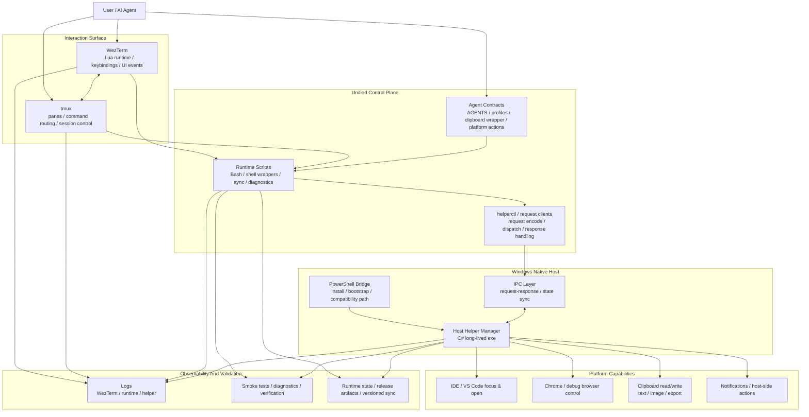

# 个人终端工作平台 v1.0

## 概述

`2026-04-17` 到 `2026-04-19` 这三天，项目完成了一次明确的阶段性跃迁。

这次里程碑的本质，不是继续修零散的终端配置，而是把一个由 `WezTerm`、`tmux`、`Lua`、`shell`、`PowerShell`、`C#`、Windows native helper 和 agent 协作规则共同组成的多语言混合项目，推进成了一套开始具备统一控制面、清晰边界、真实验证闭环和可发布能力的个人终端工作平台。

对我来说，这也是第一次把前端平时不太会深碰的几类问题真正做深：

- `C#` native helper
- `IPC`
- Windows `exe` 打包与交付
- 长生命周期后台进程
- 多语言混合项目的架构收口
- `AI 快速推进 -> 人不断纠偏 -> 真实验证闭环` 的协作方式

一句话总结：

> `v1.0` 标记的是这套 personal terminal platform 第一次形成相对完整技术主干和协作闭环的版本。

## 里程碑范围

这次里程碑覆盖了五个层面：

- 终端交互层：`WezTerm`、`tmux`、快捷键、命令路由、选择与复制行为
- 运行时控制层：shell wrappers、runtime scripts、sync、diagnostics
- Windows 平台层：native helper、`IPC`、`PowerShell` bridge、安装与发布
- 工程化层：日志、smoke test、release fallback、runtime versioning
- 协作层：agent profiles、clipboard contract、Windows 脚本执行规范

## 核心技术突破

### 1. 从前端视角真正做深了 `C# + IPC`

作为前端，日常更多接触的是 UI、状态管理、交互和接口；这次第一次把系统通信真正做进了一条运行中的控制链路。

这次的关键不是“用了 `C#`”，而是把它放进了平台主干里：

- 用 `C#` 实现 Windows 侧长期存活的 native helper manager
- 用 `IPC` 把 `WezTerm`、tmux、脚本层和 Windows helper 串起来
- 让 `IDE/VS Code` 聚焦与打开、Chrome 调起、剪贴板读写这些能力进入统一请求路径
- 开始真正理解进程间通信在真实工程里不是概念，而是控制面的基础设施

以前可能只是“知道 `IPC` 是什么”，这次是把它做成了系统主干的一部分。

### 2. 首次把 Windows `exe` 打包与交付链路纳入闭环

这次另一个明显的突破，是把 Windows helper 从脚本式能力推进成了可交付产物。

这里的重点不只是会跑构建命令，而是开始处理更完整的软件交付问题：

- 有 `dotnet` 时支持本地构建 helper
- 没有 `dotnet` 时支持 release fallback
- runtime 开始具备 version 语义
- helper 开始进入“制品、安装、升级、兼容性”的工程层

这一步把项目从“本机能跑”推进到了“能交付、能升级、能回退”。

### 3. 真正进入了多语言混合项目的架构设计

这次工作的难点，不在于语言数量，而在于这些语言分别运行在不同边界上：

- `Lua`：WezTerm 配置、运行时逻辑、快捷键和 UI 事件
- `tmux + shell`：终端交互层、命令路由、会话控制
- `PowerShell`：Windows 桥接、安装、兼容路径
- `C#`：native helper 和核心控制平面
- docs / agent profile：把系统能力变成稳定的协作 contract

真正有价值的，是这些边界开始清晰：

- 什么留在 WezTerm Lua 层
- 什么进入 tmux 作为统一交互入口
- 什么继续由 shell 承载
- 什么必须收敛到长期存活的 native helper
- 什么要抽象成 agent 可以稳定发现和调用的 contract

## v1.0 架构图

图的核心含义是：

- 交互表面仍然是 `WezTerm + tmux`
- 控制面开始通过 runtime scripts、helper clients 和 agent contracts 收敛
- Windows 平台能力开始统一落到 `C#` long-lived helper 上
- 平台能力、日志、验证和制品管理不再彼此割裂，而是开始进入同一套系统语义

## 架构层面的阶段性成果

### 1. 控制面开始统一

这三天最明显的变化，是原来分散在不同脚本和不同路径里的能力，开始往同一套控制面上收：

- `IDE/VS Code` 聚焦与打开链路
- Chrome 调试浏览器调起
- 剪贴板读写
- helper 生命周期管理
- 日志与诊断入口
- agent 可调用能力

这意味着项目开始从“很多功能点并排存在”，转向“有主干的系统”。

### 2. Windows helper 完成了一次质变

Windows helper 从混合脚本路径继续推进成 native helper 方案，并逐步具备这些特征：

- 长生命周期
- 明确 `IPC` 边界
- 更稳定的控制平面
- 更清晰的职责分层
- 可构建、可发布、可安装

这让很多原来“能跑但不够稳”的能力，开始有了统一承载体。

### 3. 项目结构从命令式堆叠走向分层和插件化

这三天不是只在加功能，也在持续拆边界、压复杂度：

- host integrations 插件化
- client runtime layers 拆分
- helperctl 职责拆分
- runtime shell modules 拆分
- state path 集中管理
- 文档结构从按读者拆分收敛到按主题拆分

这说明项目已经开始从“修补式维护”进入“面向长期演化的结构治理”。

## AI 协作与人为纠偏

这次里程碑非常重要的一点，是它不是“AI 自动产出”，而是一种逐渐清晰的人机协作模式。

这次形成的协作方式可以概括为：

- AI 负责快速探索、实现、重构、补文档、跑验证
- 人负责不断纠偏目标、提高标准、纠正误判、压实验证口径
- 每次出现偏题、验证不够真实、结构不够优雅时，都会被及时拉回
- 最终沉淀下来的不是一版“看起来能行”的方案，而是一轮被反复校正后的实现

从这三天的过程里，可以明显看到几个特点：

- 不是接受第一版答案，而是不断追问“这是不是最自然的交互”“这是不是够优雅”“是不是该插件化”“验证是不是太浅”
- 发现方向不对时，会直接打断，把问题重新拉回真正的目标
- 不满足于局部正确，而是不断把实现从“局部修补”拉向“系统收口”
- 会把验证标准从“脚本通过”抬高到“真实 smoke test”“真实链路验证”“更接近实际使用的闭环”

这很重要，因为 `v1.0` 不只是技术结果，也是一次比较成熟的人机协作实践。

## 纠偏与验证闭环

这次过程反复出现的，其实是同一个模式：

1. 先提出一个方向
2. AI 快速实现或给出结构方案
3. 人指出偏差、模糊点或不够优雅的地方
4. 改成更贴近真实意图的版本
5. 用更真实的验证方式回归
6. 在确认行为成立后再继续做结构优化

这个循环在多个问题上都很明显：

- 从复制粘贴方案回到更接近原生直觉的交互原则
- 从“性能优化已经实现”继续推进到“插件化是否成立”
- 从“跑某个测试”纠偏到“应该跑真正的 smoke test”
- 从“命名能用”继续收口到更清晰的结构命名
- 从“文档能看”推进到“文档结构本身要重构”
- 从“脚本能调用 Windows”推进到“agent 应该如何稳定、无乱码地运行这些脚本”
- 从“有剪贴板能力”推进到“它应该成为 AI 平台可稳定发现和调用的 contract”

这意味着这次里程碑不是一次线性开发，而是一轮持续校正后的系统收敛。

## 为什么这对前端背景特别有意义

因为这次真正碰到的，不只是“前端工程的外延”，而是许多以前更偏概念化的系统问题：

- `IPC` 不再只是术语，而是主通信路径
- helper 不再只是一个脚本，而是长期存活的后台进程
- `exe` 打包不再只是构建动作，而是交付模型的一部分
- 插件化不再只是组件抽象，而是跨语言能力组织方式
- 可观测性不再只是埋点，而是跨进程、跨语言链路的诊断基础
- 验证不再只是页面回归，而是控制链路 smoke test 和运行时行为验证

这些理解很难只靠看资料获得，必须靠自己把系统搭起来、踩坑、推翻、重做、再验证。

## v1.0 的结论

这三天完成的，不只是终端配置的进一步完善，而是一次更完整的系统工程实践：

- 技术上，真正做深了 `C# + IPC + native helper + exe 交付 + 多语言混合架构`
- 架构上，让这套终端工作平台开始具备统一控制面和更清晰的边界
- 工作流上，形成了一种“AI 快速推进，人不断纠偏，并通过真实验证闭环收口”的协作模式

一句话总结：

> `personal-terminal-platform-v1.0` 的本质，是我第一次把一个前端开发者平时不太会深入接触的系统工程问题，连同 AI 协作、纠偏和验证循环，一起做成了一套可以运行、可以验证、可以持续演化的平台雏形。
